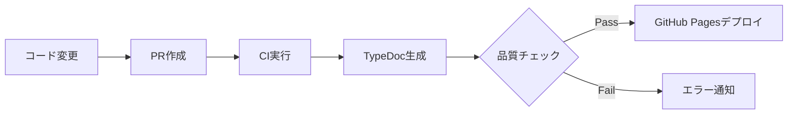

# [DOC-001] ドキュメント自動生成パイプライン構築

## 概要

技術スタックのバージョン不整合、プロジェクト名の不統一が発覚しました。ドキュメントを自動生成し、常に最新の状態を保つパイプラインを構築します。

## 対応内容

1. **TypeDoc/JSDoc導入**
   - TypeDocの設定と導入
   - JSDocコメント規約の策定
   - 既存コードへのコメント追加

2. **CIでの自動生成設定**
   - GitHub Actionsワークフローの作成
   - ドキュメント生成スクリプトの実装
   - 品質チェックの統合

3. **GitHub Pagesへの自動デプロイ**
   - GitHub Pages設定
   - 自動デプロイワークフローの作成
   - カスタムドメイン設定（必要に応じて）

## 受け入れ条件（Acceptance Criteria）

- [ ] TypeDoc/JSDocが導入され、主要モジュールにコメントが追加されている
- [ ] PRマージ時に自動でドキュメントが生成される
- [ ] 生成されたドキュメントがGitHub Pagesに自動デプロイされる
- [ ] ドキュメント内のバージョン情報が`package.json`と同期している
- [ ] ドキュメント生成に失敗した場合、CIが失敗する
- [ ] ドキュメントの検索機能が利用可能である

## 関連するレビュー発見事項

- 技術スタックのバージョン不整合が発覚
- プロジェクト名の表記揺れ（ULT Trading Platform vs ULT-TP）
- ドキュメントの手動更新による陳腐化

## 想定工数

24時間

## 優先度

High

## 担当ロール

DevOps Engineer + Tech Writer

## ラベル

`documentation`, `priority:high`, `ci-cd`, `automation`

---

## 補足情報

### ドキュメント生成フロー



### TypeDoc設定例

```json
// typedoc.json
{
  "entryPoints": ["src/index.ts"],
  "out": "docs/api",
  "theme": "default",
  "excludePrivate": true,
  "excludeProtected": true,
  "excludeExternals": true,
  "readme": "README.md",
  "name": "ULT Trading Platform API",
  "includeVersion": true
}
```

### 推奨JSDoc規約

```typescript
/**
 * 取引を実行する
 * @param symbol - 取引対象の銘柄コード
 * @param quantity - 取引数量
 * @param side - 取引方向（'buy' | 'sell'）
 * @returns 実行された取引オブジェクト
 * @throws {ValidationError} パラメータが無効な場合
 * @example
 * ```typescript
 * const trade = await executeTrade('AAPL', 100, 'buy');
 * ```
 */
async function executeTrade(
  symbol: string,
  quantity: number,
  side: 'buy' | 'sell'
): Promise<Trade> {
  // ...
}
```
