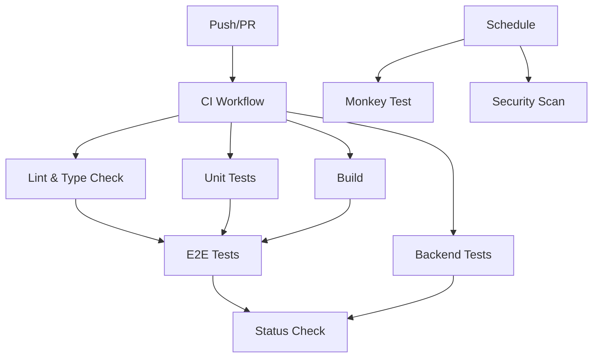

# CI/CD ガイド

このドキュメントは、ULT Trading Platform の CI/CD パイプラインについて説明します。

## 📋 目次

- [ワークフロー概要](#ワークフロー概要)
- [各ワークフローの詳細](#各ワークフローの詳細)
- [ローカルでの実行](#ローカルでの実行)
- [トラブルシューティング](#トラブルシューティング)
- [ベストプラクティス](#ベストプラクティス)

---

## ワークフロー概要

### CI パイプライン構成



### ワークフロー一覧

| ワークフロー | ファイル | 実行条件 | 所要時間 | 説明 |
|------------|---------|---------|---------|------|
| CI | `ci.yml` | Push/PR | 10-15分 | 統合パイプライン |
| Lint | `lint.yml` | Push/PR | 2-3分 | ESLint + 型チェック |
| Test | `test.yml` | Push/PR | 3-5分 | 単体テスト |
| E2E | `e2e.yml` | Push/PR | 5-8分 | E2Eテスト |
| Backend | `backend.yml` | Push/PR (backend/*) | 2-4分 | Pythonテスト |
| Build | `build.yml` | Push/PR | 3-5分 | ビルド検証 |
| Security | `security.yml` | Push/PR/週次 | 2-3分 | 脆弱性スキャン |
| Monkey Test | `monkey-test.yml` | Push/PR/日次 | 5-10分 | ランダム操作テスト |

---

## 各ワークフローの詳細

### 1. CI Workflow (`ci.yml`)

**目的**: 全ワークフローを統合し、PR マージの品質を保証

**実行内容**:
1. Lint と型チェック
2. 単体テスト
3. ビルド検証
4. バックエンドテスト
5. E2E テスト（上記が成功した場合のみ）
6. セキュリティスキャン

**成功条件**: すべてのサブワークフローが成功

### 2. Lint Workflow (`lint.yml`)

**目的**: コード品質とスタイルの一貫性を確保

**実行内容**:
- ESLint による静的解析
- TypeScript の型チェック (`tsc --noEmit`)

**ローカル実行**:
```bash
cd trading-platform
npm run lint
npx tsc --noEmit
```

### 3. Test Workflow (`test.yml`)

**目的**: 単体テストとコードカバレッジの測定

**実行内容**:
- Jest テストスイートの実行
- カバレッジレポートの生成
- カバレッジレポートのアップロード（成果物）

**ローカル実行**:
```bash
cd trading-platform
npm run test:coverage
```

**カバレッジ目標**: 80%以上

### 4. E2E Workflow (`e2e.yml`)

**目的**: ユーザーフローの動作確認

**実行内容**:
- Playwright ブラウザのインストール
- アプリケーションのビルド
- E2E テストの実行
- テスト結果とスクリーンショットのアップロード（失敗時）

**ローカル実行**:
```bash
cd trading-platform
npm run build
npm run test:e2e
# または UI モード
npm run test:e2e:ui
```

**テストシナリオ**:
- メインページの表示
- チャート操作
- 取引ワークフロー
- WebSocket 耐久性
- モンキーテスト

### 5. Backend Workflow (`backend.yml`)

**目的**: Python バックエンドの品質保証

**実行内容**:
- pytest による単体テスト
- カバレッジレポート生成

**トリガー条件**:
- `backend/**` 配下のファイル変更時
- `.github/workflows/backend.yml` の変更時

**ローカル実行**:
```bash
cd backend
python -m pytest tests/ -v --cov=src
```

### 6. Build Workflow (`build.yml`)

**目的**: 本番ビルドの成功を保証

**実行内容**:
- Next.js アプリケーションのビルド
- `.next` ディレクトリの生成確認
- ビルド成果物のアップロード

**ローカル実行**:
```bash
cd trading-platform
npm run build
```

### 7. Security Workflow (`security.yml`)

**目的**: 依存関係の脆弱性検出

**実行内容**:
- npm audit（高・重大の脆弱性チェック）
- Dependency Review (PR のみ)
- Python Safety Check
- セキュリティレポートの生成

**スケジュール**: 毎週月曜日 9:00 UTC

**ローカル実行**:
```bash
# Frontend
cd trading-platform
npm audit

# Backend
cd backend
pip install safety
safety check --file requirements.txt
```

### 8. Monkey Test Workflow (`monkey-test.yml`)

**目的**: ランダム操作による予期しないバグの検出

**実行内容**:
- 開発サーバーの起動
- ランダムな UI 操作の実行
- エラーの検出とレポート
- PR へのコメント投稿

**設定**:
- 通常実行: 30 回のイテレーション
- スケジュール実行: 100 回のイテレーション（日次 2:00 UTC）
- 手動実行: カスタムイテレーション数

**ローカル実行**:
```bash
# サーバー起動
cd trading-platform
npm run dev

# 別のターミナルで
node scripts/monkey-test.js
```

---

## ローカルでの実行

### 全テストの実行

```bash
# 1. Lint
cd trading-platform
npm run lint
npx tsc --noEmit

# 2. Test
npm run test:coverage

# 3. Build
npm run build

# 4. E2E
npm run test:e2e

# 5. Backend
cd ../backend
python -m pytest tests/ -v --cov=src
```

### 個別のワークフローシミュレーション

GitHub Actions の `act` ツールを使用してローカルで実行できます：

```bash
# act のインストール
brew install act  # macOS
# または
sudo apt-get install act  # Linux

# ワークフローの実行
act -j lint
act -j test
act -j build
```

---

## トラブルシューティング

### よくある問題

#### 1. Lint エラー

**問題**: ESLint エラーでワークフローが失敗

**解決方法**:
```bash
cd trading-platform
npm run lint:fix
git add .
git commit -m "fix: lint errors"
```

#### 2. 型エラー

**問題**: TypeScript 型エラー

**解決方法**:
```bash
cd trading-platform
npx tsc --noEmit
# エラーを修正後
git add .
git commit -m "fix: type errors"
```

#### 3. テスト失敗

**問題**: 単体テストが失敗

**解決方法**:
```bash
cd trading-platform
npm test -- --verbose
# 失敗したテストを修正
npm test
```

#### 4. E2E テスト失敗

**問題**: Playwright テストが失敗

**解決方法**:
```bash
cd trading-platform
npm run test:e2e:ui  # UI モードでデバッグ
# または
npm run test:e2e:headed  # ヘッドモードで確認
```

#### 5. ビルド失敗

**問題**: Next.js ビルドが失敗

**解決方法**:
```bash
cd trading-platform
rm -rf .next
npm run build
# エラーメッセージを確認して修正
```

#### 6. 依存関係の問題

**問題**: npm install や npm ci が失敗

**解決方法**:
```bash
cd trading-platform
rm -rf node_modules package-lock.json
npm install
npm run build
```

### CI が通らない場合のチェックリスト

- [ ] ローカルで `npm run lint` が成功する
- [ ] ローカルで `npx tsc --noEmit` が成功する
- [ ] ローカルで `npm test` が成功する
- [ ] ローカルで `npm run build` が成功する
- [ ] ローカルで `npm run test:e2e` が成功する
- [ ] `.env.example` に必要な環境変数が記載されている
- [ ] GitHub Secrets に必要な値が設定されている

---

## ベストプラクティス

### 1. コミット前のチェック

```bash
# pre-commit hook の活用
# .git/hooks/pre-commit に以下を追加
#!/bin/bash
cd trading-platform
npm run lint || exit 1
npx tsc --noEmit || exit 1
npm test || exit 1
```

または、Husky を使用：

```bash
cd trading-platform
npx husky install
npx husky add .git/hooks/pre-commit "npm run lint && npm test"
```

### 2. ブランチ戦略

- `main`: 本番環境用、常に CI が通る状態を保つ
- `develop`: 開発用、機能ブランチの統合先
- `feature/*`: 機能追加
- `fix/*`: バグ修正
- `hotfix/*`: 緊急修正

### 3. PR 作成前のチェック

```bash
# 全チェックを一度に実行
cd trading-platform
npm run lint && \
npx tsc --noEmit && \
npm test && \
npm run build && \
npm run test:e2e
```

### 4. CI の高速化

- 変更のないファイルのテストをスキップ（Jest の `--findRelatedTests`）
- 依存関係のキャッシュを活用
- 並列実行を最大限活用

### 5. セキュリティ

- 定期的な依存関係の更新
- `npm audit fix` の定期実行
- Dependabot の有効化推奨

---

## GitHub Secrets の設定

以下の Secrets を GitHub リポジトリに設定してください：

| Secret 名 | 説明 | 必須 |
|----------|------|------|
| `ALPHA_VANTAGE_API_KEY` | Alpha Vantage API キー | ✅ |

**設定方法**:
1. GitHub リポジトリページへ移動
2. Settings > Secrets and variables > Actions
3. "New repository secret" をクリック
4. Secret 名と値を入力して保存

---

## 参考リンク

- [GitHub Actions Documentation](https://docs.github.com/en/actions)
- [Next.js CI/CD Best Practices](https://nextjs.org/docs/deployment)
- [Jest Best Practices](https://jestjs.io/docs/getting-started)
- [Playwright Best Practices](https://playwright.dev/docs/best-practices)

---

**更新日**: 2026-02-01
