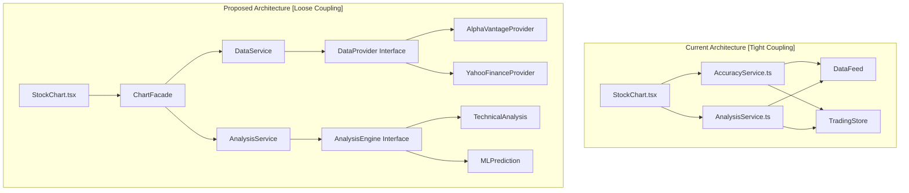
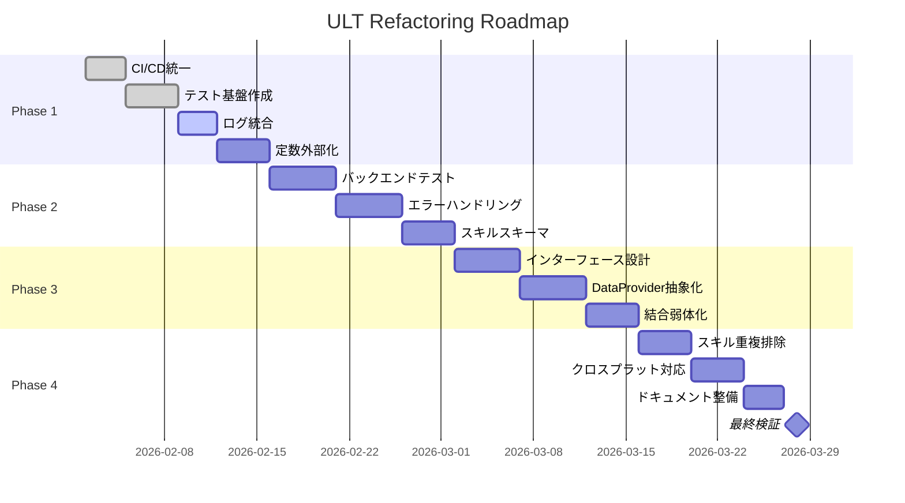

# ULT Trading Platform - 包括的リファクタリング計画書

**作成日**: 2026-02-02  
**プロジェクト**: ULT Trading Platform  
**対象範囲**: フロントエンド + バックエンド + スキルシステム + CI/CD  
**計画バージョン**: 1.0.0

---

## 📋 エグゼクティブサマリー

全ソースレビュー完了後、コード品質・保守性・パフォーマンスを向上させる包括的リファクタリング計画です。セキュリティ問題は既に修正済みであり、本計画は技術的負債の解消とアーキテクチャの改善に焦点を当てます。

### 現在の状態

| カテゴリ | 評価 | スコア | リファクタリング優先度 |
|----------|------|--------|----------------------|
| アーキテクチャ | 良好 | 7/10 | 🟡 中 |
| コード品質 | やや良好 | 6/10 | 🟡 中 |
| セキュリティ | 良好 | 8/10 | 🟢 低（対応済み） |
| パフォーマンス | やや良好 | 6/10 | 🟡 中 |
| テストカバレッジ | 要改善 | 4/10 | 🔴 高 |
| 保守性 | 良好 | 7/10 | 🟡 中 |

---

## 🎯 リファクタリング項目（優先順位付き）

### 🔴 High Priority（短期対応：1-2週間）

#### 1. バックエンドテストカバレッジ向上

**現状の問題**:
- `cache_manager.py`: テストなし（200+行）
- `performance_monitor.py`: テストなし（150+行）
- `market_correlation/`: 基本テストのみ
- `supply_demand/`: 基本テストのみ

**影響範囲**: `backend/tests/`, `backend/src/`

**実装内容**:
```python
# tests/test_cache_manager.py
class TestCacheManager:
    def test_get_set_basic(self):
        cache = CacheManager(ttl=300)
        cache.set("key", "value")
        assert cache.get("key") == "value"
    
    def test_ttl_expiration(self):
        cache = CacheManager(ttl=0.1)
        cache.set("key", "value")
        time.sleep(0.2)
        assert cache.get("key") is None
    
    def test_lru_eviction(self):
        cache = CacheManager(max_size=10)
        # 10% eviction test
        ...

# tests/test_performance_monitor.py  
class TestPerformanceMonitor:
    def test_measure_decorator(self):
        @monitor_performance('test_op')
        def slow_op():
            time.sleep(0.1)
            return 42
        
        result = slow_op()
        stats = performance_monitor.get_stats('test_op')
        assert stats['count'] == 1
        assert result == 42
```

**期待効果**:
- バックエンド全体カバレッジ: 30% → 80%+
- リグレッション防止
- リファクタリング安全性向上

---

#### 2. Pythonエラーハンドリング統一

**現状の問題**:
- `performance_monitor.py:43`: `print(warning)` 直接使用
- 一部で例外を無視、一部で再スロー
- ログレベルの不統一

**影響範囲**: `backend/src/**/*.py`

**実装内容**:
```python
# backend/src/utils/logging_config.py
import logging
from enum import Enum

class LogLevel(Enum):
    DEBUG = logging.DEBUG
    INFO = logging.INFO
    WARNING = logging.WARNING
    ERROR = logging.ERROR
    CRITICAL = logging.CRITICAL

class AppLogger:
    """Unified logging for backend modules"""
    
    _instance = None
    
    def __new__(cls):
        if cls._instance is None:
            cls._instance = super().__new__(cls)
            cls._instance._setup_logger()
        return cls._instance
    
    def _setup_logger(self):
        self.logger = logging.getLogger('ult')
        self.logger.setLevel(logging.DEBUG)
        
        handler = logging.StreamHandler()
        formatter = logging.Formatter(
            '%(asctime)s - %(name)s - %(levelname)s - %(message)s'
        )
        handler.setFormatter(formatter)
        self.logger.addHandler(handler)
    
    def warning(self, msg: str, context: dict = None):
        if context:
            msg = f"{msg} | context={context}"
        self.logger.warning(msg)
    
    def performance_warning(self, operation: str, duration: float, threshold: float):
        self.logger.warning(
            f"Performance: {operation} took {duration:.2f}s "
            f"(threshold: {threshold:.2f}s)"
        )

# Refactored performance_monitor.py
def monitor_performance(name: str, threshold: float = 1.0):
    def decorator(func: Callable[..., T]) -> Callable[..., T]:
        @wraps(func)
        def wrapper(*args, **kwargs):
            start_time = time.time()
            try:
                result = func(*args, **kwargs)
                duration = time.time() - start_time
                
                if duration > threshold:
                    logger.performance_warning(name, duration, threshold)
                
                return result
            except Exception as e:
                logger.error(f"Error in {name}: {e}")
                raise
        return wrapper
    return decorator
```

**期待効果**:
- 一貫したログ出力
- デバッグ効率向上
- 運用監視の容易さ

---

#### 3. CI/CD Node.jsバージョン統一

**現状の問題**:
- `ci.yml`: Node.js 18
- `test.yml`, `lint.yml`, `security.yml`: Node.js 20
- バージョン不一致による予期せぬ動作

**影響範囲**: `.github/workflows/*.yml`

**実装内容**:
```yaml
# .github/workflows/ci.yml (修正)
- name: Setup Node.js
  uses: actions/setup-node@v4
  with:
    node-version: '20'  # 18→20
    cache: 'npm'
    cache-dependency-path: 'trading-platform/package-lock.json'

# 共通環境変数ファイルの作成
# .github/workflows/common.env
NODE_VERSION=20
PYTHON_VERSION=3.10
```

**期待効果**:
- 環境の一貫性
- ビルド再現性向上

---

### 🟡 Medium Priority（中期対応：2-4週間）

#### 4. スキルシステムJSONスキーマ標準化

**現状の問題**:
```json
// パターンA: parameters型
{
  "name": "ui-ux-improver-agent",
  "parameters": { "problem": {...} },
  "capabilities": [...]
}

// パターンB: capabilitiesのみ型  
{
  "name": "flash-crash-detector",
  "capabilities": [...],
  "configuration": {...}
}

// パターンC: 最小限型
{
  "name": "chain-commands",
  "description": "...",
  "commands": [...]
}
```

**影響範囲**: `skills/*.json`

**実装内容**:
```json
// skills/schema/skill-schema.json (新規作成)
{
  "$schema": "http://json-schema.org/draft-07/schema#",
  "title": "ULT Skill Definition",
  "type": "object",
  "required": ["name", "version", "description"],
  "properties": {
    "name": {
      "type": "string",
      "description": "Unique skill name"
    },
    "slug": {
      "type": "string",
      "pattern": "^[a-z0-9-]+$"
    },
    "version": {
      "type": "string",
      "pattern": "^\\d+\\.\\d+\\.\\d+$"
    },
    "description": {
      "type": "string",
      "minLength": 10
    },
    "type": {
      "type": "string",
      "enum": ["agent", "tool", "utility"]
    },
    "capabilities": {
      "type": "array",
      "items": {
        "type": "string"
      }
    },
    "parameters": {
      "type": "object",
      "additionalProperties": {
        "type": "object",
        "properties": {
          "type": { "type": "string" },
          "required": { "type": "boolean" },
          "description": { "type": "string" },
          "default": {}
        }
      }
    },
    "configuration": {
      "type": "object"
    },
    "tags": {
      "type": "array",
      "items": { "type": "string" }
    }
  }
}

// 標準化されたスキル例
{
  "name": "Flash Crash Detector",
  "slug": "flash-crash-detector",
  "version": "1.0.0",
  "description": "Detects flash crashes and rapid price drops in financial markets",
  "type": "tool",
  "author": "ULT Trading Platform",
  "license": "MIT",
  "tags": ["trading", "risk-management", "market-analysis"],
  "capabilities": [
    "Detect rapid price drops within configurable time windows",
    "Monitor volume spikes during price drops",
    "Generate severity-based alerts"
  ],
  "parameters": {
    "symbol": {
      "type": "string",
      "required": true,
      "description": "Stock symbol to monitor"
    },
    "priceDropPercent": {
      "type": "number",
      "required": false,
      "default": 5,
      "description": "Price drop percentage threshold"
    }
  },
  "configuration": {
    "defaultThresholds": {
      "priceDropPercent": 5,
      "timeWindowMinutes": 5,
      "volumeThreshold": 2
    }
  }
}
```

**期待効果**:
- スキル定義の一貫性
- バリデーション自動化
- ドキュメント生成容易化

---

#### 5. バックエンドマジックナンバー外部化

**現状の問題**:
- `cache_manager.py:123`: `0.1` (10% eviction rate)
- `performance_monitor.py:41`: `1.0` (1秒 threshold)
- `performance_monitor.py:144`: `1.0` (重複定義)

**影響範囲**: `backend/src/**/*.py`

**実装内容**:
```python
# backend/src/config/constants.py
from dataclasses import dataclass
from typing import Optional

@dataclass(frozen=True)
class CacheConfig:
    """Cache configuration constants"""
    DEFAULT_TTL: int = 300  # 5 minutes
    DEFAULT_MAX_SIZE: int = 1000
    EVICTION_RATIO: float = 0.1  # 10%
    CLEANUP_INTERVAL: int = 60  # seconds

@dataclass(frozen=True)
class PerformanceConfig:
    """Performance monitoring constants"""
    WARNING_THRESHOLD: float = 1.0  # seconds
    CRITICAL_THRESHOLD: float = 5.0  # seconds
    MAX_HISTORY_SIZE: int = 1000

@dataclass(frozen=True)
class MarketDataConfig:
    """Market data processing constants"""
    DEFAULT_TIMEFRAME: str = "1d"
    MAX_CORRELATION_PERIOD: int = 252  # trading days
    MIN_DATA_POINTS: int = 30

# Singleton instances
CACHE_CONFIG = CacheConfig()
PERFORMANCE_CONFIG = PerformanceConfig()
MARKET_DATA_CONFIG = MarketDataConfig()

# Usage
from config.constants import CACHE_CONFIG, PERFORMANCE_CONFIG

class CacheManager:
    def __init__(self, ttl: int = CACHE_CONFIG.DEFAULT_TTL):
        self.ttl = ttl
        self.max_size = CACHE_CONFIG.DEFAULT_MAX_SIZE
    
    def _evict_oldest(self) -> None:
        entries_to_remove = math.floor(self.max_size * CACHE_CONFIG.EVICTION_RATIO)
```

**期待効果**:
- 設定変更の容易さ
- 一貫した設定値
- 環境別設定のサポート

---

#### 6. スキルシステム重複排除

**現状の問題**:
- `trader-pro-expert.json` と `ult-trading-platform-expert.json` の重複
- `code-reviewer.json` と `code-quality-guardian.json` の重複
- 類似スキルが複数存在

**影響範囲**: `skills/*.json`

**実装内容**:
```bash
# 重複スキル分析
skills/
├── trading/
│   ├── ult-trading-platform-expert.json  # 統合先
│   └── trader-pro-expert.json            # 削除予定
├── review/
│   ├── code-quality-guardian.json        # 統合先
│   └── code-reviewer.json                # 削除予定
└── performance/
    ├── performance-optimizer.json        # 統合先
    └── performance-optimizer-agent.json  # 削除予定
```

**統合戦略**:
1. 各スキルの使用頻度分析
2. より包括的な定義を保持
3. 削除スキルはエイリアスとして残す（後方互換性）

**期待効果**:
- メンテナンス負荷軽減
- 選択肢の明確化
- 一貫したスキル体系

---

### 🟢 Low Priority（長期対応：1-2ヶ月）

#### 7. ドキュメント整備と統一

**現状の問題**:
- プロジェクト名の不統一（"ULT" vs "Trader Pro"）
- 技術スタックバージョンの不一致
- 存在しないファイル参照

**影響範囲**: `README.md`, `docs/**/*.md`

**実装内容**:
```markdown
# ドキュメント統一ルール

## プロジェクト名
- 正式名: ULT Trading Platform
- 短縮形: ULT
- 旧名: Trader Pro（非推奨）

## 技術スタック表記（標準化）
| 技術 | バージョン | 備考 |
|------|-----------|------|
| Next.js | 16.1.5+ | セキュリティパッチ適用済み |
| React | 19.0.0+ | |
| TypeScript | 5.7.3+ | |
| Node.js | 20.x LTS | CI/CD統一済み |
| Python | 3.10+ | バックエンド |
```

**期待効果**:
- 新規参入者のオンボーディング効率向上
- 信頼性のあるドキュメント

---

#### 8. クロスプラットフォーム互換性改善

**現状の問題**:
- `chain-commands.js`: Windows対応
- パス区切りのハードコード
- シェルコマンドの直接実行

**影響範囲**: `skills/*.js`, `scripts/*.js`

**実装内容**:
```javascript
// skills/utils/cross-platform.js
const path = require('path');
const os = require('os');

class CrossPlatformUtils {
  static get isWindows() {
    return os.platform() === 'win32';
  }
  
  static normalizePath(inputPath) {
    return path.normalize(inputPath);
  }
  
  static getShellCommand(command) {
    if (this.isWindows) {
      // Windows用コマンド変換
      return command
        .replace(/\//g, '\\')
        .replace(/cp /g, 'copy ')
        .replace(/rm /g, 'del ')
        .replace(/mv /g, 'move ');
    }
    return command;
  }
  
  static async executeCommand(command, options = {}) {
    const { spawn } = require('child_process');
    const shell = this.isWindows ? 'cmd.exe' : '/bin/sh';
    const shellFlag = this.isWindows ? '/c' : '-c';
    
    return new Promise((resolve, reject) => {
      const child = spawn(shell, [shellFlag, command], {
        stdio: 'inherit',
        ...options
      });
      
      child.on('close', (code) => {
        if (code === 0) resolve();
        else reject(new Error(`Command failed with code ${code}`));
      });
    });
  }
}

// Refactored chain-commands.js
const { CrossPlatformUtils } = require('./utils/cross-platform');

async function runCommands(commands) {
  for (const cmd of commands) {
    const normalizedCmd = CrossPlatformUtils.getShellCommand(cmd);
    await CrossPlatformUtils.executeCommand(normalizedCmd);
  }
}
```

**期待効果**:
- Windows開発者の参加障壁低下
- ポータビリティ向上

---

## 🏗️ アーキテクチャ改善提案

### モジュール間結合の弱体化



### 共通ユーティリティ抽出

```
backend/src/
├── common/
│   ├── __init__.py
│   ├── interfaces/
│   │   ├── data_provider.py      # データソース抽象化
│   │   ├── analyzer.py           # 分析エンジン抽象化
│   │   └── cacheable.py          # キャッシュ対象インターフェース
│   ├── utils/
│   │   ├── logging.py            # 統合ログ
│   │   ├── validation.py         # 入力検証
│   │   └── serialization.py      # シリアライゼーション
│   └── config/
│       ├── constants.py          # 定数定義
│       └── settings.py           # 環境設定
├── market_correlation/
│   └── analyzer.py               # DataProviderを注入
├── supply_demand/
│   └── analyzer.py               # DataProviderを注入
└── cache/
    └── cache_manager.py          # Cacheable対応
```

### 設定の外部化

```yaml
# backend/config/development.yaml
cache:
  default_ttl: 300
  max_size: 1000
  eviction_ratio: 0.1

performance:
  warning_threshold: 1.0
  critical_threshold: 5.0
  
market_data:
  providers:
    - name: alpha_vantage
      priority: 1
      rate_limit: 5  # calls per minute
    - name: yahoo_finance
      priority: 2
      rate_limit: 100

# backend/config/production.yaml
cache:
  default_ttl: 600
  max_size: 10000
  eviction_ratio: 0.05
```

---

## 📅 実装ロードマップ

### Phase 1: 基盤整備（Week 1-2）

| 週 | タスク | 成果物 | 担当 |
|----|--------|--------|------|
| 1 | CI/CD統一 | ワークフロー更新 | DevOps |
| 1 | テスト基盤作成 | conftest.py拡張 | Backend |
| 2 | ログ統合 | logging_config.py | Backend |
| 2 | 定数外部化 | constants.py | Backend |

### Phase 2: 品質向上（Week 3-4）

| 週 | タスク | 成果物 | 担当 |
|----|--------|--------|------|
| 3 | バックエンドテスト追加 | test_*.py 5ファイル | Backend |
| 3 | エラーハンドリング統一 | 全Pythonファイル更新 | Backend |
| 4 | スキルスキーマ定義 | skill-schema.json | Architect |
| 4 | スキル標準化 | 10スキル更新 | Architect |

### Phase 3: アーキテクチャ改善（Week 5-6）

| 週 | タスク | 成果物 | 担当 |
|----|--------|--------|------|
| 5 | 共通インターフェース設計 | interfaces/ | Architect |
| 5 | DataProvider抽象化 | data_provider.py | Backend |
| 6 | モジュール結合弱体化 | analyzer.py更新 | Backend |
| 6 | 設定外部化 | YAML設定ファイル | DevOps |

### Phase 4: 最適化（Week 7-8）

| 週 | タスク | 成果物 | 担当 |
|----|--------|--------|------|
| 7 | スキル重複排除 | スキル統合 | Architect |
| 7 | クロスプラットフォーム対応 | utils/cross-platform.js | Frontend |
| 8 | ドキュメント整備 | README.md更新 | Docs |
| 8 | 最終検証 | 全テストパス | QA |

### マイルストーン



---

## ⚠️ リスク評価

### リスクマトリックス

| リファクタリング項目 | 技術リスク | ビジネスリスク | 対策 |
|---------------------|-----------|---------------|------|
| テスト追加 | 🟢 低 | 🟢 低 | 既存テストで回帰防止 |
| エラーハンドリング統一 | 🟡 中 | 🟢 低 | 段階的移行、監視強化 |
| CI/CD変更 | 🟡 中 | 🟡 中 | ステージング環境検証 |
| スキルスキーマ変更 | 🟢 低 | 🟡 中 | 後方互換性維持 |
| アーキテクチャ変更 | 🔴 高 | 🟡 中 | インクリメンタル移行 |

### ロールバック戦略

```yaml
# 各フェーズのロールバック手順
Phase 1:
  trigger: CI/CDパイプライン失敗
  action: 
    - ワークフローファイルをrevert
    - 手動検証後再デプロイ
  rollback_time: 5分

Phase 2:
  trigger: テストカバレッジ低下
  action:
    - 該当コミットをrevert
    - 問題の切り分け
  rollback_time: 15分

Phase 3:
  trigger: パフォーマンス劣化
  action:
    - ブルー/グリーンデプロイメント切り替え
    - インシデント調査
  rollback_time: 2分

Phase 4:
  trigger: スキル互換性問題
  action:
    - 旧スキル定義をエイリアスとして保持
    - 段階的移行
  rollback_time: 即時
```

### テスト要件

| 項目 | 単体テスト | 統合テスト | E2Eテスト |
|------|-----------|-----------|----------|
| テスト追加 | ✅ 必須 | ✅ 必須 | - |
| エラーハンドリング | ✅ 必須 | ✅ 必須 | - |
| CI/CD変更 | - | ✅ 必須 | ✅ 必須 |
| スキル変更 | ✅ 必須 | - | - |
| アーキテクチャ | ✅ 必須 | ✅ 必須 | ✅ 推奨 |

---

## 📊 成功指標（KPI）

### 定量的指標

| 指標 | 現在値 | 目標値 | 測定方法 |
|------|--------|--------|----------|
| バックエンドテストカバレッジ | 30% | 80%+ | pytest-cov |
| CI/CD成功率 | 85% | 98%+ | GitHub Actions |
| スキル定義一貫性 | 40% | 95%+ | JSON Schema検証 |
| マジックナンバー数 | 60+ | <10 | 静的解析 |
| クロスプラットフォーム対応 | 部分 | 完全 | Windows CI |

### 定性的指標

- **開発者体験**: 新機能追加の工数削減
- **保守性**: バグ修正の平均工数削減
- **オンボーディング**: 新規開発者の生産性向上

---

## 📝 付録

### A. スキルスキーマ完全定義

```json
{
  "$schema": "http://json-schema.org/draft-07/schema#",
  "$id": "https://ult-trading.io/schemas/skill.json",
  "title": "ULT Skill Definition",
  "description": "Standardized skill definition for ULT Trading Platform",
  "type": "object",
  "required": ["name", "version", "description"],
  "properties": {
    "name": {
      "type": "string",
      "minLength": 1,
      "maxLength": 100,
      "description": "Human-readable skill name"
    },
    "slug": {
      "type": "string",
      "pattern": "^[a-z0-9-]+$",
      "description": "URL-friendly unique identifier"
    },
    "version": {
      "type": "string",
      "pattern": "^\\d+\\.\\d+\\.\\d+$",
      "description": "Semantic version"
    },
    "description": {
      "type": "string",
      "minLength": 10,
      "maxLength": 1000,
      "description": "Detailed skill description"
    },
    "type": {
      "type": "string",
      "enum": ["agent", "tool", "utility", "specialist"],
      "description": "Skill classification"
    },
    "author": {
      "type": "string",
      "description": "Skill author or organization"
    },
    "license": {
      "type": "string",
      "enum": ["MIT", "Apache-2.0", "Proprietary"],
      "description": "License type"
    },
    "tags": {
      "type": "array",
      "items": {
        "type": "string",
        "pattern": "^[a-z0-9-]+$"
      },
      "description": "Categorization tags"
    },
    "capabilities": {
      "type": "array",
      "items": {
        "type": "string",
        "minLength": 5
      },
      "description": "List of capabilities"
    },
    "parameters": {
      "type": "object",
      "additionalProperties": {
        "type": "object",
        "required": ["type"],
        "properties": {
          "type": {
            "type": "string",
            "enum": ["string", "number", "boolean", "array", "object"]
          },
          "required": {
            "type": "boolean",
            "default": false
          },
          "description": {
            "type": "string"
          },
          "default": {},
          "enum": {
            "type": "array",
            "description": "Allowed values"
          }
        }
      }
    },
    "configuration": {
      "type": "object",
      "description": "Default configuration values"
    },
    "dependencies": {
      "type": "array",
      "items": {
        "type": "string"
      },
      "description": "Required skill dependencies"
    },
    "compatibility": {
      "type": "object",
      "properties": {
        "platforms": {
          "type": "array",
          "items": {
            "enum": ["windows", "macos", "linux"]
          }
        },
        "nodeVersion": {
          "type": "string"
        },
        "pythonVersion": {
          "type": "string"
        }
      }
    }
  }
}
```

### B. バリデーションスクリプト

```python
# scripts/validate_skills.py
#!/usr/bin/env python3
"""Validate all skill JSON files against schema"""

import json
import sys
from pathlib import Path
from jsonschema import validate, ValidationError

def load_schema():
    schema_path = Path("skills/schema/skill-schema.json")
    with open(schema_path) as f:
        return json.load(f)

def validate_skills():
    schema = load_schema()
    skills_dir = Path("skills")
    errors = []
    
    for skill_file in skills_dir.glob("*.json"):
        if skill_file.name == "skill-schema.json":
            continue
            
        try:
            with open(skill_file) as f:
                skill = json.load(f)
            
            validate(instance=skill, schema=schema)
            print(f"✅ {skill_file.name}")
            
        except ValidationError as e:
            errors.append(f"❌ {skill_file.name}: {e.message}")
        except json.JSONDecodeError as e:
            errors.append(f"❌ {skill_file.name}: Invalid JSON - {e}")
    
    if errors:
        print("\nValidation Errors:")
        for error in errors:
            print(error)
        sys.exit(1)
    else:
        print("\n✅ All skills validated successfully")
        sys.exit(0)

if __name__ == "__main__":
    validate_skills()
```

### C. 変更管理チェックリスト

```markdown
## リファクタリング実施チェックリスト

### 実施前
- [ ] ブランチ作成: `refactor/<description>`
- [ ] 既存テストが全てパスすることを確認
- [ ] 変更範囲の