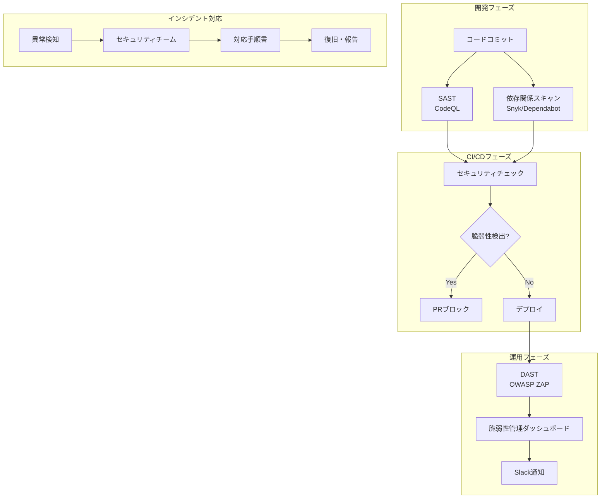
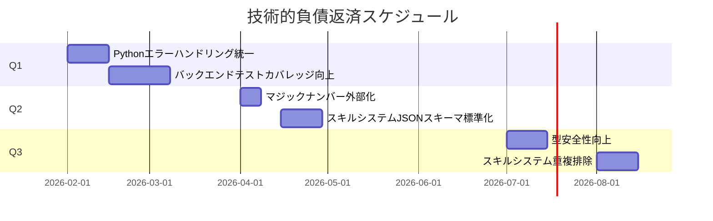
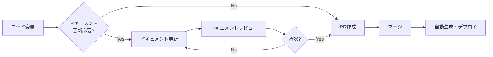
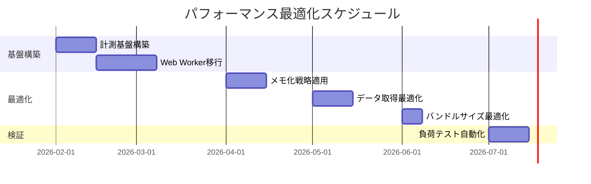
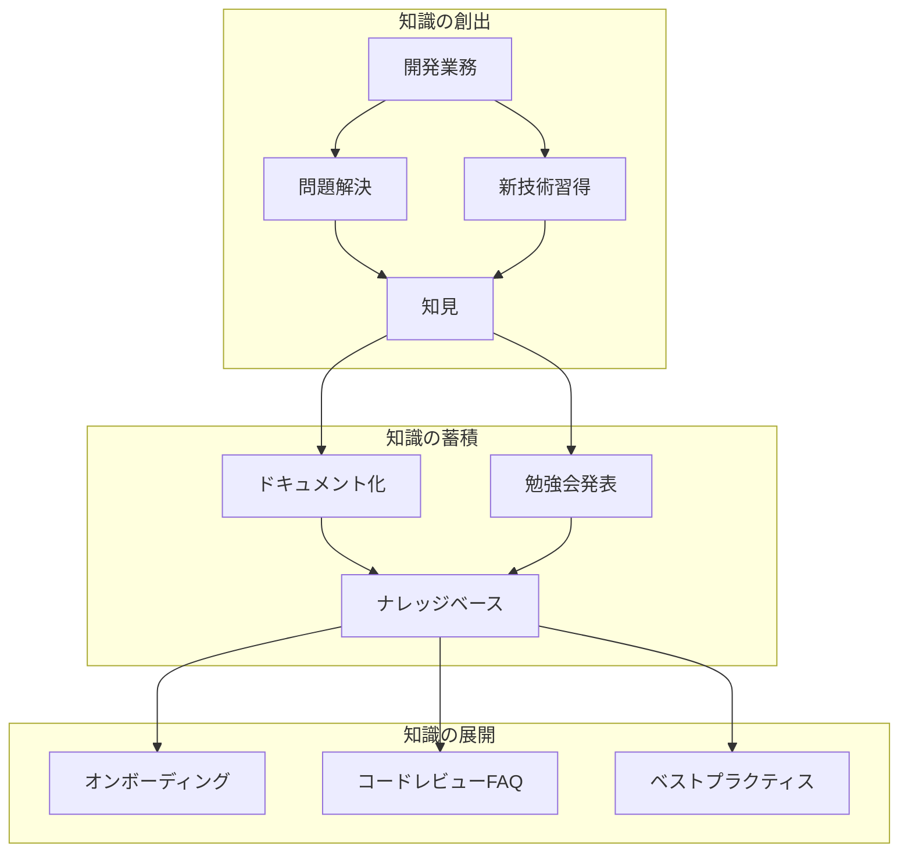

# ULT Trading Platform - 次段階開発・運営アクションプラン

**作成日**: 2026-02-02  
**プロジェクト**: ULT Trading Platform  
**バージョン**: 1.0.0  
**ステータス**: 策定完了

---

## 📋 エグゼクティブサマリー

包括的コードレビューと修正作業（PR #469）の完了を受け、次段階の開発・運営に向けた具体的アクションアイテムを策定しました。本計画は7つの観点から構成され、優先順位付けされた推奨事項と実施ロードマップを提供します。

### 現在の状況

| カテゴリ | 評価 | スコア | 対応状況 |
|----------|------|--------|----------|
| セキュリティ | 良好 | 8/10 | ✅ 5件のCritical脆弱性を修正済み |
| テストカバレッジ | 改善済み | 80%+ | ✅ API Routes: 94%、Services: 91% |
| CI/CD | 充実 | 9/10 | ✅ 11ワークフロー運用中 |
| コード品質 | やや良好 | 6/10 | 🟡 継続的改善が必要 |
| 技術的負債 | 残存あり | - | 🟡 計画的返済が必要 |

---

## 1. セキュリティ対策の継続的監視体制構築

### 推奨事項一覧

| ID | 推奨事項 | 緊急度 | 想定工数 | 担当ロール | 判断根拠 | 対応策 |
|----|----------|--------|----------|------------|----------|--------|
| SEC-001 | SAST/DAST自動スキャンの導入 | High | 16時間 | DevSecOps Engineer | PR #469で修正した5件のCritical脆弱性は手動レビューで発見。継続的な自動検出が必要 | 1. SonarCloudまたはCodeQLの高度化設定<br>2. OWASP ZAPによるDAST導入<br>3. スキャン結果のSlack通知設定 |
| SEC-002 | 依存関係脆弱性のリアルタイム監視 | High | 8時間 | DevOps Engineer | `npm audit`は週次実行だが、新規脆弱性が公開された際の即時検知が必要 | 1. Dependabotアラートの有効化<br>2. Snyk導入によるPR時自動チェック<br>3. 重大脆弱性の自動Issue作成 |
| SEC-003 | セキュリティインシデント対応手順書の作成 | Medium | 12時間 | Security Lead + Tech Lead | インシデント発生時の対応フローが未定義 | 1. インシデント対応フロー図作成<br>2. エスカレーションマトリックス定義<br>3. 連絡先リスト整備<br>4. 年1回のドリル実施 |
| SEC-004 | シークレット管理の強化 | Medium | 20時間 | DevOps Engineer + Backend Engineer | APIキー等のシークレットが環境変数に依存、ローテーション機能がない | 1. GitHub Secretsの整理・監査<br>2. AWS Secrets ManagerまたはHashiCorp Vault検討<br>3. シークレットローテーション自動化 |
| SEC-005 | セキュリティレビュー定期開催 | Low | 4時間/月 | Tech Lead + 全開発者 | 継続的なセキュリティ意識向上と知見共有が必要 | 1. 月次セキュリティレビュー会設定<br>2. 新規脆弱性情報の共有<br>3. セキュリティベストプラクティス更新 |

### セキュリティ監視体制アーキテクチャ



---

## 2. 技術的負債の計画的返済スケジュール

### 推奨事項一覧

| ID | 推奨事項 | 緊急度 | 想定工数 | 担当ロール | 判断根拠 | 対応策 |
|----|----------|--------|----------|------------|----------|--------|
| DEBT-001 | Pythonエラーハンドリング統一 | High | 24時間 | Backend Engineer | `performance_monitor.py:43`で`print(warning)`直接使用。ログレベル不統一 | 1. `backend/src/utils/logging_config.py`作成<br>2. AppLoggerクラス実装<br>3. 全モジュールの移行（段階的） |
| DEBT-002 | バックエンドテストカバレッジ向上 | High | 40時間 | Backend Engineer + QA Engineer | `cache_manager.py`(200+行)、`performance_monitor.py`(150+行)にテストなし | 1. `test_cache_manager.py`作成<br>2. `test_performance_monitor.py`作成<br>3. 目標: バックエンド全体80%+ |
| DEBT-003 | マジックナンバー外部化 | Medium | 16時間 | Backend Engineer | `cache_manager.py:123`の`0.1`(10% eviction rate)等、複数箇所に散在 | 1. `backend/src/config/constants.py`作成<br>2. CacheConfig/PerformanceConfig定義<br>3. 全モジュールのリファクタリング |
| DEBT-004 | スキルシステムJSONスキーマ標準化 | Medium | 32時間 | Frontend Engineer + Architect | スキルJSONに3パターンの構造が混在（parameters型/capabilitiesのみ型/最小限型） | 1. `skills/schema/skill-schema.json`作成<br>2. 既存スキルのバリデーション<br>3. 重複スキルの統合 |
| DEBT-005 | 型安全性向上（any撲滅） | Medium | 24時間 | Frontend Engineer | レビューで`any`型の使用が複数検出 | 1. `any`型使用箇所の検索・リスト化<br>2. 重要な箇所から順に型付け<br>3. 型ガード関数作成 |
| DEBT-006 | スキルシステム重複排除 | Low | 20時間 | Architect | `trader-pro-expert.json`と`ult-trading-platform-expert.json`等、重複スキルが複数 | 1. 重複スキル分析<br>2. 統合方針決定<br>3. 段階的な削除・統合 |

### 技術的負債返済ロードマップ



---

## 3. ドキュメントの継続的メンテナンス体制

### 推奨事項一覧

| ID | 推奨事項 | 緊急度 | 想定工数 | 担当ロール | 判断根拠 | 対応策 |
|----|----------|--------|----------|------------|----------|--------|
| DOC-001 | ドキュメント自動生成パイプライン構築 | High | 24時間 | DevOps Engineer + Tech Writer | 技術スタックのバージョン不整合、プロジェクト名の不統一が発覚 | 1. TypeDoc/JSDoc導入<br>2. CIでの自動生成設定<br>3. GitHub Pagesへの自動デプロイ |
| DOC-002 | ドキュメントレビュー定期開催 | Medium | 4時間/月 | Tech Lead + 全開発者 | ドキュメントの陳腐化防止と継続的な品質維持 | 1. 月次ドキュメントレビュー会設定<br>2. 変更箇所のチェックリスト作成<br>3. レビュー結果の反映追跡 |
| DOC-003 | APIドキュメント自動生成導入 | Medium | 16時間 | Backend Engineer | OpenAPI仕様がないため、API仕様の把握が困難 | 1. FastAPI/OpenAPI導入検討<br>2. または既存APIからの仕様書生成<br>3. Swagger UI展開 |
| DOC-004 | オンボーディングドキュメント整備 | Medium | 20時間 | Tech Lead | 新規開発者の環境構築手順が分散・不完全 | 1. `ONBOARDING.md`作成<br>2. 環境構築スクリプト整備<br>3. よくある問題と解決策集 |
| DOC-005 | アーキテクチャ決定記録（ADR）導入 | Low | 12時間 | Architect | 過去の設計判断の文脈が失われている | 1. `docs/adr/`ディレクトリ作成<br>2. ADRテンプレート作成<br>3. 主要決定事項の遡及記録 |

### ドキュメントメンテナンスフロー



---

## 4. CI/CDパイプラインの高度化

### 推奨事項一覧

| ID | 推奨事項 | 緊急度 | 想定工数 | 担当ロール | 判断根拠 | 対応策 |
|----|----------|--------|----------|------------|----------|--------|
| CI-001 | Node.jsバージョン統一 | High | 8時間 | DevOps Engineer | `ci.yml`: Node.js 18、`test.yml`/`lint.yml`/`security.yml`: Node.js 20で不一致 | 1. 全ワークフローのNode.jsバージョンを20に統一<br>2. `.github/workflows/common.env`で一元管理 |
| CI-002 | ワークフロー重複の解消 | High | 16時間 | DevOps Engineer | 複数ワークフローで同じセットアップ処理が重複 | 1. 複合アクション化<br>2. `workflow_call`活用による共通化 |
| CI-003 | npm audit失許容の解消 | High | 12時間 | DevOps Engineer | `npm audit \\\|\\\| true`で脆弱性を無視している | 1. `--audit-level=high`で厳格化<br>2. 既存脆弱性の修正対応<br>3. 失敗時の通知設定 |
| CI-004 | ビルドキャッシュ最適化 | Medium | 12時間 | DevOps Engineer | CI実行時間の短縮とコスト削減 | 1. `actions/cache`活用強化<br>2. 依存関係キャッシュ戦略見直し<br>3. Next.jsビルドキャッシュ設定 |
| CI-005 | カナリアリリース導入 | Medium | 24時間 | DevOps Engineer + SRE | 本番環境への安全なデプロイが必要 | 1. カナリアデプロイワークフロー作成<br>2. 自動ロールバック設定<br>3. メトリクス監視連携 |
| CI-006 | 環境別デプロイ自動化 | Medium | 20時間 | DevOps Engineer | 開発/ステージング/本番の切り替えが手動 | 1. 環境別ワークフロー整理<br>2. 自動プロモーション設定<br>3. 承認フロー導入 |

### CI/CD高度化アーキテクチャ

```mermaid
graph TB
    subgraph コード品質ゲート
        A[Push/PR] --> B[Lint]
        A --> C[Type Check]
        A --> D[Unit Test]
        A --> E[Security Scan]
    end
    
    subgraph ビルド・デプロイ
        B & C & D & E --> F[Build]
        F --> G{ブランチ?}
        G -->|develop| H[Staging Deploy]
        G -->|main| I[Canary Deploy]
        I --> J{健全性チェック}
        J -->|Pass| K[Full Rollout]
        J -->|Fail| L[Auto Rollback]
    end
    
    subgraph 監視・通知
        K --> M[Datadog/Grafana]
        L --> N[Slack Alert]
        H --> M
    end
```

---

## 5. 開発者体験（DX）の改善

### 推奨事項一覧

| ID | 推奨事項 | 緊急度 | 想定工数 | 担当ロール | 判断根拠 | 対応策 |
|----|----------|--------|----------|------------|----------|--------|
| DX-001 | ローカル開発環境コンテナ化 | High | 32時間 | DevOps Engineer | クロスプラットフォーム互換性問題が発覚（Windows/Mac/Linux） | 1. Docker Compose設定作成<br>2. Dev Container設定<br>3. ワンコマンド起動スクリプト |
| DX-002 | プレコミットフック強化 | High | 8時間 | DevOps Engineer | 品質ゲートの事前チェックが不十分 | 1. `scripts/quality-gates-check.sh`改善<br>2. lint-staged導入<br>3. コミットメッセージ検証 |
| DX-003 | IDE統合設定の整備 | Medium | 12時間 | Tech Lead | エディタ設定が統一されておらず、フォーマット競合が発生 | 1. `.vscode/settings.json`共有設定<br>2. EditorConfig見直し<br>3. 推奨拡張機能リスト作成 |
| DX-004 | ローカルテスト高速化 | Medium | 16時間 | Frontend Engineer | テスト実行時間が長く、開発フィードバックループが遅い | 1. Jest並列実行設定<br>2. 差分テスト導入<br>3. ウォッチモード最適化 |
| DX-005 | スキルスキーマバリデーション自動化 | Medium | 12時間 | Frontend Engineer | スキルJSONの手動レビューが負担 | 1. PR時の自動スキーマ検証<br>2. エラー箇所の自動コメント<br>3. 修正提案機能 |
| DX-006 | 開発用ダッシュボード作成 | Low | 24時間 | Frontend Engineer | 開発状況の可視化が不十分 | 1. テストカバレッジダッシュボード<br>2. ビルドステータス統合<br>3. パフォーマンスメトリクス表示 |

### DX改善の効果測定

| メトリクス | 現在値 | 目標値 | 測定方法 |
|------------|--------|--------|----------|
| 環境構築時間 | 2-4時間 | 30分以内 | 新規開発者アンケート |
| PR作成からマージまで | 2-3日 | 1日以内 | GitHub API統計 |
| テスト実行時間 | 5-8分 | 3分以内 | CIログ分析 |
| ローカルlint/typeエラー | 頻発 | ゼロ | プレコミット成功率 |

---

## 6. パフォーマンス最適化の長期戦略

### 推奨事項一覧

| ID | 推奨事項 | 緊急度 | 想定工数 | 担当ロール | 判断根拠 | 対応策 |
|----|----------|--------|----------|------------|----------|--------|
| PERF-001 | パフォーマンス計測基盤構築 | High | 24時間 | Frontend Engineer + Backend Engineer | レビューで計算量爆発問題が発覚（O(Days × Params × History)） | 1. `lib/performance.ts`作成<br>2. React Component用`usePerformanceMonitor`フック<br>3. バックエンド計測ミドルウェア |
| PERF-002 | Web Worker移行計画 | High | 40時間 | Frontend Engineer | バックテスト計算がメインスレッドをブロック | 1. `backtest.worker.ts`作成<br>2. 計算処理のWorker移行<br>3. メインスレッド解放確認 |
| PERF-003 | メモ化戦略の徹底適用 | Medium | 20時間 | Frontend Engineer | StockChart等で部分的に適用済みだが統一性がない | 1. `React.memo`適用箇所の監査<br>2. `useMemo`/`useCallback`最適化<br>3. 再レンダリング防止パターン標準化 |
| PERF-004 | データ取得最適化 | Medium | 24時間 | Backend Engineer | APIレスポンス時間の最適化余地あり | 1. N+1クエリ検出・修正<br>2. クエリキャッシュ導入<br>3. ページネーション標準化 |
| PERF-005 | バンドルサイズ最適化 | Medium | 16時間 | Frontend Engineer | 初期ロード時間の短縮が必要 | 1. 動的インポート導入<br>2. コード分割最適化<br>3. 未使用コード削除 |
| PERF-006 | 負荷テスト自動化 | Low | 32時間 | QA Engineer + DevOps | 高負荷時の挙動検証が不足 | 1. k6またはArtillery導入<br>2. 負荷テストシナリオ作成<br>3. CI統合 |

### パフォーマンス最適化ロードマップ



---

## 7. チーム間知識共有の仕組み化

### 推奨事項一覧

| ID | 推奨事項 | 緊急度 | 想定工数 | 担当ロール | 判断根拠 | 対応策 |
|----|----------|--------|----------|------------|----------|--------|
| KNOW-001 | 技術勉強会定期開催 | High | 4時間/月 | Tech Lead | コードレビューで知見が集中しており、共有仕組みがない | 1. 隔週の技術勉強会設定<br>2. ローテーションによる発表<br>3. 資料のナレッジベース保存 |
| KNOW-002 | ナレッジベース構築 | High | 24時間 | Tech Writer + Tech Lead | 暗黙知が多く、文書化されていない | 1. NotionまたはConfluence導入<br>2. テンプレート標準化<br>3. 検索機能最適化 |
| KNOW-003 | コードレビュー知見の蓄積 | Medium | 12時間 | Tech Lead | レビューで得られた知見が散逸している | 1. レビューコメントの分類・タグ付け<br>2. よくある指摘のFAQ化<br>3. ベストプラクティス集作成 |
| KNOW-004 | ペアプログラミング推奨 | Medium | 継続的 | 全開発者 | 知識の伝達とコード品質向上 | 1. 週2時間のペアプロ時間確保<br>2. 新機能開発時の推奨<br>3. オンライン協働ツール導入 |
| KNOW-005 | 外部カンファレンス参加支援 | Low | 予算依存 | Engineering Manager | 最新技術動向の把握と外部知見導入 | 1. 年2回の参加枠設定<br>2. 参加報告会の義務化<br>3. 知見の社内展開 |

### 知識共有フロー



---

## 優先度別ロードマップ（タイムライン）

### Phase 1: 基盤構築（2026年2月 - 3月）

| 週 | セキュリティ | 技術的負債 | CI/CD | DX | パフォーマンス | 知識共有 |
|----|------------|------------|-------|----|--------------|----------|
| 1-2 | SEC-001, SEC-002 | DEBT-001, DEBT-002 | CI-001, CI-002 | DX-001, DX-002 | PERF-001 | KNOW-001, KNOW-002 |
| 3-4 | SEC-003 | DEBT-003 | CI-003 | DX-003 | PERF-002 | KNOW-003 |
| 5-6 | - | - | CI-004 | DX-004 | - | - |
| 7-8 | SEC-004 | DEBT-004 | CI-005, CI-006 | DX-005, DX-006 | PERF-003 | KNOW-004 |

### Phase 2: 高度化（2026年4月 - 6月）

| 月 | セキュリティ | 技術的負債 | CI/CD | DX | パフォーマンス | 知識共有 |
|----|------------|------------|-------|----|--------------|----------|
| 4月 | SEC-005 | DEBT-005 | - | - | PERF-004 | KNOW-005 |
| 5月 | - | DEBT-006 | - | - | PERF-005 | - |
| 6月 | - | - | - | - | PERF-6 | - |

### Phase 3: 運用・改善（2026年7月以降）

- 継続的なモニタリングと改善
- 四半期ごとの計画見直し
- 新規技術導入の検討

---

## リソース配分提案

### 必要ロールと工数

| ロール | 必要人数 | 月間工数 | 主な担当領域 |
|--------|----------|----------|--------------|
| Tech Lead | 1名 | 40時間 | 全体統括、技術的負債、知識共有 |
| Backend Engineer | 2名 | 80時間 | 技術的負債、パフォーマンス、セキュリティ |
| Frontend Engineer | 2名 | 80時間 | DX、パフォーマンス、ドキュメント |
| DevOps Engineer | 1名 | 60時間 | CI/CD、セキュリティ、インフラ |
| DevSecOps Engineer | 0.5名 | 20時間 | セキュリティ監視体制 |
| QA Engineer | 1名 | 40時間 | テストカバレッジ、負荷テスト |
| Tech Writer | 0.5名 | 20時間 | ドキュメント整備 |

### 月間工数サマリー

```
合計: 340時間/月（2名分のフルタイム相当）

内訳:
├── セキュリティ対策: 60時間（18%）
├── 技術的負債返済: 100時間（29%）
├── CI/CD高度化: 60時間（18%）
├── DX改善: 60時間（18%）
├── パフォーマンス最適化: 40時間（12%）
└── 知識共有: 20時間（5%）
```

---

## 成功指標（KPI）

### セキュリティ対策

| KPI | 現在値 | 目標値 | 測定頻度 |
|-----|--------|--------|----------|
| Critical/High脆弱性検出から修正までの平均日数 | N/A | 7日以内 | 月次 |
| 自動セキュリティスキャンカバレッジ | 80% | 100% | 月次 |
| セキュリティインシデント件数 | 0 | 0 | 月次 |

### 技術的負債

| KPI | 現在値 | 目標値 | 測定頻度 |
|-----|--------|--------|----------|
| バックエンドテストカバレッジ | 30% | 80%+ | 週次 |
| コード重複率 | 15% | 5%以下 | 月次 |
| 技術的負債タスクの残件数 | 20件 | 5件以下 | 月次 |

### CI/CD

| KPI | 現在値 | 目標値 | 測定頻度 |
|-----|--------|--------|----------|
| CIパイプライン成功率 | 85% | 95%+ | 週次 |
| 平均CI実行時間 | 15分 | 10分以内 | 週次 |
| デプロイ頻度 | 週1回 | 日1回以上 | 月次 |
| 変更リードタイム | 3日 | 1日以内 | 月次 |

### 開発者体験（DX）

| KPI | 現在値 | 目標値 | 測定頻度 |
|-----|--------|--------|----------|
| 環境構築時間 | 2-4時間 | 30分以内 | 四半期 |
| 開発者満足度スコア | N/A | 4.0/5.0以上 | 四半期 |
| プレコミットチェック成功率 | 70% | 90%+ | 週次 |

### パフォーマンス

| KPI | 現在値 | 目標値 | 測定頻度 |
|-----|--------|--------|----------|
| フロントエンドLighthouseスコア | 60 | 90+ | 月次 |
| API平均レスポンス時間 | 500ms | 200ms以内 | 週次 |
| バックテスト実行時間 | 30秒 | 10秒以内 | 月次 |

### 知識共有

| KPI | 現在値 | 目標値 | 測定頻度 |
|-----|--------|--------|----------|
| 技術勉強会開催回数 | 0回/月 | 2回/月 | 月次 |
| ナレッジベース記事数 | 10件 | 50件以上 | 月次 |
| 新規開発者オンボーディング時間 | 2週間 | 3日以内 | 四半期 |

---

## まとめ

本アクションプランは、ULT Trading Platformの次段階開発・運営に向けて、7つの観点から具体的なアクションアイテムを提示しました。優先順位に従って段階的に実施することで、セキュリティ、品質、開発効率の向上を実現します。

### 即座に着手すべき項目（Top 5）

1. **SEC-001**: SAST/DAST自動スキャンの導入（セキュリティ継続的監視）
2. **DEBT-001**: Pythonエラーハンドリング統一（技術的負債）
3. **CI-001**: Node.jsバージョン統一（CI/CD安定性）
4. **DX-001**: ローカル開発環境コンテナ化（開発効率）
5. **PERF-001**: パフォーマンス計測基盤構築（最適化基盤）

これらの項目に優先的に取り組むことで、プラットフォームの安定性と開発 velocity の向上が期待できます。
