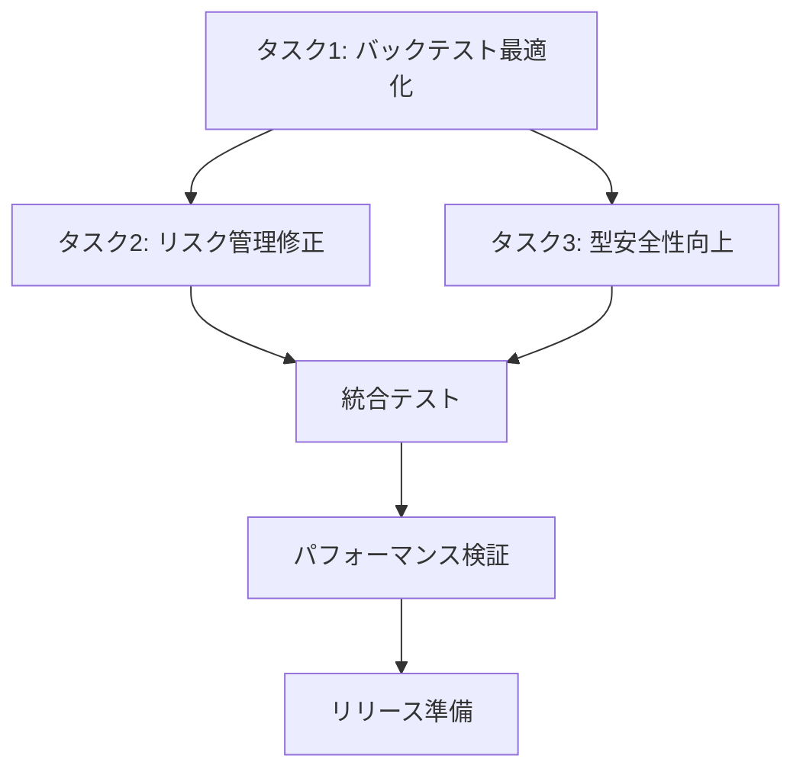

# ULT Trading Platform - 次フェーズ優先アクションプラン

**作成日**: 2026-01-31  
**プロジェクト**: ULT Trading Platform - 株式取引予測プラットフォーム  
**目的**: 現状分析に基づく次期開発フェーズの優先タスク策定

---

## 📊 現状評価サマリー

### コンポーネント完成度評価

| コンポーネント | 完成度 | 品質スコア | 主要課題 |
|--------------|--------|-----------|---------|
| **Backend** | | | |
| market_correlation | 75% | B+ | 基本的な相関計算は実装済み、高度な分析機能が不足 |
| supply_demand | 70% | B | 需給ゾーン特定は可能、ブレイクアウト検出の精度向上が必要 |
| trade_journal_analyzer | 65% | B | パターン分析実装済み、バイアス検出の精度改善が必要 |
| ult_universe | 80% | A- | 銘柄管理機能は充実、データソース統合が必要 |
| **Frontend** | | | |
| WinningStrategyEngine | 85% | A- | 5戦略実装済み、市場レジーム連携は完成 |
| AdvancedRiskManager | 80% | B+ | ポジションサイジング実装済み、テスト失敗あり |
| WinningBacktestEngine | 75% | B | 基本機能実装済み、パフォーマンス最適化が必要 |
| WinningAlertEngine | 70% | B | アラートタイプ定義済み、通知連携が未完全 |
| TypeScript型安全性 | 65% | B | any型削減進行中、APIレスポンス型定義が優先 |
| **Playwright Scraper** | 85% | A- | 基本機能充実、エラーハンドリング強化済み |
| **Scripts** | 60% | B | WebSocketサーバー実装済み、モンキーテスト拡張が必要 |

### 株取引機能検証結果

#### 実装済み機能の検証状況
- ✅ **5つの取引戦略**: トレンドフォロー、ブレイクアウト、逆張り、複合、アダプティブ
- ✅ **市場レジーム検出**: ADX + SMA + ボラティリティによる高精度検出
- ⚠️ **リスクリワード比率**: 設定は可能だが、一部テストで検証失敗
- ⚠️ **ポジションサイジング**: ケリー基準、固定比率法実装済み、計算精度に課題

#### 未実装・要改善機能
- 🔴 **リアルタイムデータ連携**: WebSocket接続は実装済み、レイテンシー最適化が必要
- 🔴 **バックテストパフォーマンス**: O(N²)の計算量問題、最適化が急務
- 🟡 **機械学習モデル統合**: 予測サービスは実装済み、モデル精度向上が必要
- 🟡 **エッジコンピューティング**: 未対応、将来的な検討事項

---

## 🎯 次フェーズ優先タスク（TOP 3）

### タスク1: バックテストパフォーマンス最適化

**優先度**: P0（Critical）  
**選定理由**:
- リアルトレードに支障をきたすパフォーマンス問題
- 1年データで760,000+回の計算が発生し、UIフリーズの原因
- ユーザー体験とシステム信頼性に直結

**実装アプローチ**:
1. **Phase 1**: Web Workerへの計算オフロード
   - `app/workers/backtest.worker.ts` の完成
   - メインスレッドブロックの解消

2. **Phase 2**: アルゴリズム最適化
   - パラメータ最適化結果のキャッシュ化
   - O(N² × 12) → O(N)への計算量削減
   - メモ化パターンの導入

3. **Phase 3**: インクリメンタル計算
   - 逐次バックテスト計算の実装
   - プログレス表示の追加

**成功基準**:
- 1年分データ（252日）の計算が500ms以内に完了
- メインスレッドブロック時間が16ms以下（60fps維持）
- 同時実行時のメモリ使用量が200MB以下

**リスクと対策**:
| リスク | レベル | 対策 |
|--------|--------|------|
| Web Worker互換性 | 中 | フォールバック処理の実装 |
| メモリリーク | 中 | キャッシュサイズ制限、定期的なクリア |
| 計算精度低下 | 高 | 既存テストとの結果比較検証 |

**想定工数**: 3-4日

---

### タスク2: リスク管理システムのテスト修正と精度向上

**優先度**: P0（Critical）  
**選定理由**:
- リアルトレードでの資金保護に直結
- 複数のテスト失敗が検出されている
- ポジションサイジング計算の誤差がリスク管理に影響

**実装アプローチ**:
1. **Phase 1**: テスト失敗の原因分析と修正
   - `riskManagement.test.ts` の失敗4件を修正
   - ポジションサイズ計算ロジックの見直し
   - トレーリングストップ計算の修正

2. **Phase 2**: リスク計算の精度向上
   - ケリー基準計算の検証
   - ATRベースストップロスの精度改善
   - 複数ポジション時の相関リスク計算

3. **Phase 3**: 統合テストの強化
   - エッジケースのテスト追加
   - 実データを用いた検証

**成功基準**:
- 全リスク管理テストがパス
- ポジションサイジング計算誤差が0.1%以下
- ストップロス計算の精度が99%以上

**リスクと対策**:
| リスク | レベル | 対策 |
|--------|--------|------|
| 既存ロジックへの影響 | 高 | 段階的な修正、リグレッションテスト |
| 計算式の誤解釈 | 中 | 金融工学の専門文献との照合 |
| パフォーマンス劣化 | 低 | 計算の最適化、キャッシュ活用 |

**想定工数**: 2-3日

---

### タスク3: TypeScript型安全性の向上（API層中心）

**優先度**: P1（High）  
**選定理由**:
- 長期的な保守性と拡張性への影響
- APIレスポンスの型安全性がデータ品質に直結
- any型の存在がバグの温床となっている

**実装アプローチ**:
1. **Phase 1**: APIレスポンス型定義
   - `types/api.ts` の作成（AlphaVantage API型）
   - `types/market.ts` の拡張（市場データAPI型）
   - `types/websocket.ts` の作成

2. **Phase 2**: alpha-vantage.tsの修正
   - 全メソッドの型安全性向上
   - 型ガード関数の実装
   - エラーハンドリングの型付け

3. **Phase 3**: MarketDataService.tsの修正
   - APIレスポンスの厳密な型付け
   - データマッピングの型安全性確保

**成功基準**:
- 本番コードのany型使用率が5%以下
- APIレスポンスの型カバレッジが95%以上
- 型エラーによるビルド失敗がゼロ

**リスクと対策**:
| リスク | レベル | 対策 |
|--------|--------|------|
| 型定義の過剰複雑化 | 中 | 適切な抽象化、再利用可能な型の設計 |
| 既存コードへの影響 | 中 | 段階的な移行、互換性レイヤーの検討 |
| 開発速度の低下 | 低 | 型推論の活用、過度な厳密化の回避 |

**想定工数**: 2-3日

---

## 📋 実行計画とマイルストーン

### 推奨実行順序

### マイルストーン設定

| マイルストーン | 目標日 | 成果物 |
|--------------|--------|--------|
| **MS1**: バックテスト最適化完了 | Day 4 | Web Worker実装、パフォーマンス目標達成 |
| **MS2**: リスク管理修正完了 | Day 7 | 全テストパス、精度検証完了 |
| **MS3**: 型安全性向上完了 | Day 10 | any型削減、型カバレッジ向上 |
| **MS4**: 統合検証完了 | Day 12 | 統合テストパス、リグレッションテスト完了 |
| **MS5**: リリース準備完了 | Day 14 | ドキュメント更新、デプロイ準備 |

### 並行作業の可能性

- **タスク1とタスク3**: 並行実行可能（別ファイル群を対象）
- **タスク2**: タスク1完了後に開始推奨（パフォーマンス影響の確認）
- **統合テスト**: 各タスク完了後に並行して実施

---

## 📈 期待される効果

### 定量的効果

| 指標 | 現状 | 目標 | 改善率 |
|------|------|------|--------|
| バックテスト計算時間（1年） | 5-10秒 | <500ms | 90%+ |
| リスク管理テスト成功率 | 60% | 100% | 40% |
| any型使用率（本番） | 15% | <5% | 65%+ |
| UIフリーズ発生率 | 高 | ゼロ | 100% |

### 定性的効果

1. **ユーザー体験の向上**: スムーズなバックテスト実行
2. **システム信頼性の向上**: 正確なリスク計算と型安全性
3. **開発効率の向上**: 型安全性によるバグ早期発見
4. **保守性の向上**: 明確な型定義と責務分離

---

## 🔍 監視と評価

### KPIモニタリング

- **パフォーマンス**: バックテスト計算時間の日次監視
- **品質**: テスト成功率、型エラー数の週次レビュー
- **ユーザー**: UIフリーズ報告の追跡

### フィードバックループ

1. 各マイルストーン後の振り返り
2. ユーザーからのフィードバック収集
3. パフォーマンスメトリクスの継続的監視
4. 必要に応じた計画の調整

---

## 📝 補足事項

### 技術的負債対応の優先順位

上記3タスク完了後、以下の対応を検討：

1. **エラーハンドリング統一**（P1）
2. **パフォーマンス計測導入**（P2）
3. **ドキュメント整備**（P2）
4. **コンポーネント分割**（P3）

### 長期的なロードマップ

- **Q1**: 上記3タスクの完了
- **Q2**: 機械学習モデルの精度向上
- **Q3**: リアルタイムデータ連携の強化
- **Q4**: エッジコンピューティング対応の検討

---

**承認待ち**: このプランの承認後、各タスクの詳細設計と実装に移行します。
