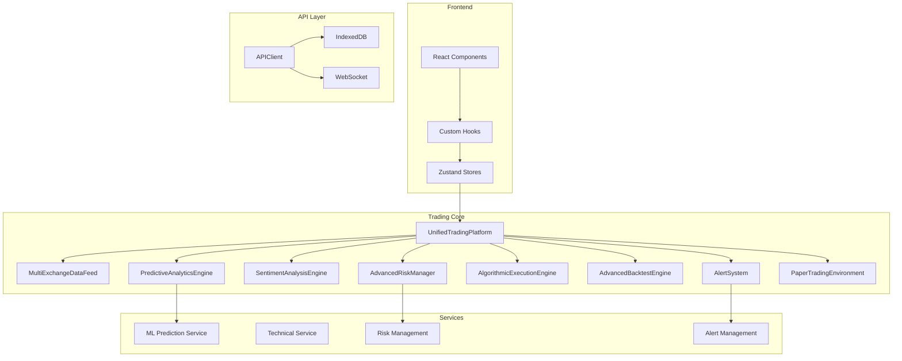
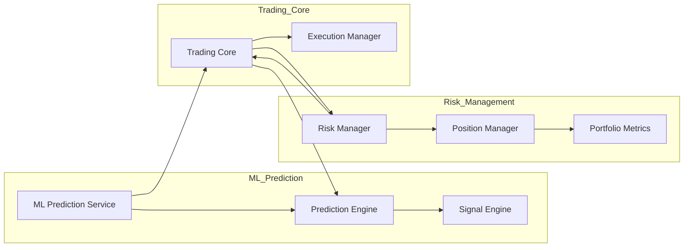

# 取引プラットフォーム改善提案書

## 目次
1. [技術的負債とアーキテクチャ上の課題](#1-技術的負債とアーキテクチャ上の課題)
2. [市場環境・エッジケース対応強化](#2-市場環境エッジケース対応強化)
3. [ユーザー体験とパフォーマンス最適化](#3-ユーザー体験とパフォーマンス最適化)
4. [新機能の追加機会](#4-新機能の追加機会)
5. [テストカバレッジとコード品質向上](#5-テストカバレッジとコード品質向上)
6. [セキュリティとコンプライアンス強化](#6-セキュリティとコンプライアンス強化)
7. [統合システムとの連携](#7-統合システムとの連携)
8. [実施優先順位とロードマップ](#8-実施優先順位とロードマップ)

---

## 1. 技術的負債とアーキテクチャ上の課題

### 1.1 現在のシステム構成



### 1.2 技術的負債の詳細

| 項目 | 現状 | 影響 | 解決策 |
|-----|------|------|--------|
| **型定義の重複** | `OHLCV`が複数ファイルで定義 | 型の不整合リスク | 単一ソース化 |
| **コード重複** | `TechnicalIndicatorCalculator`が複数存在 | 保守コスト増加 | 統合・サービス化 |
| **イベントEmitterの多用** | 各クラスがEventEmitterを継承 | メモリリークリスク | Pub/Subパターン導入 |
| **ロギングの非統一** | console.logが散在 | デバッグ困難 | ロガーの統一 |
| **エラー処理の不備** | try/catchが不完全 | クラッシュリスク | エラーバウンダリ強化 |

### 1.3 アーキテクチャ改善提案

#### 1.3.1 型の統合

**課題**: [`types/index.ts`](trading-platform/app/types/index.ts) と [`PredictiveAnalyticsEngine.ts`](trading-platform/app/lib/aiAnalytics/PredictiveAnalyticsEngine.ts) で重複定義

```typescript
// 現在の問題
// types/index.ts
export interface OHLCV {
  date: string;
  open: number;
  high: number;
  low: number;
  close: number;
  volume: number;
}

// PredictiveAnalyticsEngine.ts
export interface OHLCV {
  date: string;
  open: number;
  high: number;
  low: number;
  close: number;
  volume: number;
}
```

**解決策**: 共用型ファイルを作成

```typescript
// types/shared.ts
export type SharedOHLCV = {
  date: string;
  open: number;
  high: number;
  low: number;
  close: number;
  volume: number;
};

// types/index.ts から再エクスポート
export type { SharedOHLCV as OHLCV } from './shared';
```

#### 1.3.2 TechnicalIndicatorServiceの統合

**課題**: [`TechnicalIndicatorService.ts`](trading-platform/app/lib/TechnicalIndicatorService.ts) と [`TechnicalIndicatorCalculator`](trading-platform/app/lib/aiAnalytics/PredictiveAnalyticsEngine.ts) が重複

**解決策**: 単一のサービスに統合

```typescript
// services/TechnicalIndicatorFactory.ts
import { technicalIndicatorService } from '@/app/lib/TechnicalIndicatorService';

export class TechnicalIndicatorFactory {
  static calculateAll(prices: number[], ohlcv: OHLCV[]): TechnicalFeatures {
    return {
      rsi: technicalIndicatorService.calculateRSI(prices, 14),
      ema12: technicalIndicatorService.calculateEMA(prices, 12),
      ema26: technicalIndicatorService.calculateEMA(prices, 26),
      macd: technicalIndicatorService.calculateMACD(prices),
      bollingerBands: technicalIndicatorService.calculateBollingerBands(prices),
      atr: technicalIndicatorService.calculateATR(ohlcv, 14),
      williamsR: this.calculateWilliamsR(ohlcv),
      stochastic: this.calculateStochastic(ohlcv),
      adx: this.calculateADX(ohlcv),
      // ... 他の指標
    };
  }
}
```

#### 1.3.3 イベントシステムの改善

**課題**: 各クラスが独立したEventEmitterを持つ

**解決策**: 中央集権的なイベントバス

```typescript
// core/EventBus.ts
type EventMap = {
  'trade:executed': TradeResult;
  'signal:generated': TradingSignal;
  'risk:alert': RiskAlert;
  'portfolio:updated': Portfolio;
};

class EventBus {
  private emitter = new EventEmitter();
  
  emit<K extends keyof EventMap>(event: K, data: EventMap[K]): void {
    this.emitter.emit(event, data);
  }
  
  on<K extends keyof EventMap>(event: K, handler: (data: EventMap[K]) => void): void {
    this.emitter.on(event, handler);
  }
  
  off<K extends keyof EventMap>(event: K, handler: (data: EventMap[K]) => void): void {
    this.emitter.off(event, handler);
  }
}

export const eventBus = new EventBus();
```

### 1.4 リファクタリング優先度

| 優先度 | 項目 | 工数 | リスク | 効果 |
|-------|------|-----|-------|------|
| **高** | 型定義の統合 | 1日 | 低 | 保守性大幅向上 |
| **高** | TechnicalIndicatorの統合 | 2日 | 中 | 重複コード削減 |
| **中** | イベントシステム統一 | 3日 | 中 | メモリ管理改善 |
| **中** | ロガー統一 | 1日 | 低 | デバッグ効率向上 |
| **低** | エラーハンドリング強化 | 2日 | 中 | 安定性向上 |

---

## 2. 市場環境・エッジケース対応強化

### 2.1 現在の対応状況

[`mlPrediction.ts`](trading-platform/app/lib/mlPrediction.ts) の市場相関分析は基本的な対応のみ

### 2.2 改善が必要なエッジケース

| エッジケース | 現状 | 問題点 | 対策 |
|-------------|------|--------|------|
| **フラッシュクラッシュ** | 単一日足で検出困難 | 急激な価格下落に対応不可 | 1分足レベルの監視追加 |
| **ギャップダウン/アップ** | 損切りが機能しない | 窓空きで約定価格と乖離 | ，成り行き注文の最適化 |
| **流動性低下** | 出来高のみで判断 | 板の薄さを考慮しない | Order Book分析追加 |
| **特殊市場イベント** | 対応なし | IPO、合併、株式分割 | コーポレートアクション対応 |
| **取引停止** | 対応なし | 発注エラー発生 | 取引可能状態チェック |

### 2.3 実装提案

#### 2.3.1 フラッシュクラッシュ検出

```typescript
// market/FlashCrashDetector.ts
interface FlashCrashConfig {
  priceDropPercent: number;  // デフォルト5%
  timeWindowMinutes: number; // デフォルト5
  volumeThreshold: number;   // デフォルト2倍
}

class FlashCrashDetector {
  private config: FlashCrashConfig;
  
  detect(data: OHLCV[]): FlashCrashAlert | null {
    const recent = data.slice(-60); // 直近60分
    
    // 5分足で急激な下落を検出
    const maxDrop = this.calculateMaxDrop(recent);
    
    if (maxDrop > this.config.priceDropPercent) {
      return {
        type: 'FLASH_CRASH',
        severity: 'CRITICAL',
        dropPercent: maxDrop,
        detectedAt: new Date(),
        recommendedAction: 'HALT_TRADING'
      };
    }
    
    return null;
  }
  
  private calculateMaxDrop(data: OHLCV[]): number {
    // 直近5分足の最大下落率を計算
    // ...
  }
}
```

#### 2.3.2 ギャップリスク管理

```typescript
// market/GapRiskManager.ts
class GapRiskManager {
  calculateGapRisk(symbol: string, data: OHLCV[]): GapRiskAssessment {
    const prevClose = data[data.length - 2].close;
    const open = data[data.length - 1].open;
    const gapPercent = Math.abs((open - prevClose) / prevClose) * 100;
    
    const typicalGap = this.calculateTypicalGap(data);
    const gapDeviation = (gapPercent - typicalGap) / typicalGap;
    
    return {
      gapPercent,
      typicalGap,
      gapDeviation,
      riskLevel: gapPercent > 5 ? 'HIGH' : gapPercent > 2 ? 'MEDIUM' : 'LOW',
      recommendedStopLoss: this.calculateAdaptiveStopLoss(open, gapPercent)
    };
  }
  
  private calculateAdaptiveStopLoss(open: number, gapPercent: number): number {
    // ギャップを考慮した適応的損切りライン
    const baseStop = 0.02; // 2%
    const gapAdjustment = Math.min(gapPercent / 100, 0.05); // ギャップの5%まで
    return open * (1 - baseStop - gapAdjustment);
  }
}
```

#### 2.3.3 取引可能状態チェック

```typescript
// market/TradingEligibilityChecker.ts
class TradingEligibilityChecker {
  async checkEligibility(symbol: string): Promise<TradingEligibility> {
    const [status, halts, corporateActions] = await Promise.all([
      this.checkTradingStatus(symbol),
      this.checkTradingHalt(symbol),
      this.checkCorporateActions(symbol)
    ]);
    
    return {
      isEligible: status === 'TRADING' && !halts.isHalted && !corporateActions.hasAction,
      status,
      haltInfo: halts,
      corporateActionInfo: corporateActions,
      restrictions: this.getRestrictions(status, halts, corporateActions)
    };
  }
  
  private getRestrictions(status: string, halts: any, actions: any): string[] {
    const restrictions: string[] = [];
    
    if (status !== 'TRADING') {
      restrictions.push(`市場状態が${status}です`);
    }
    if (halts.isHalted) {
      restrictions.push(`取引停止中: ${halts.reason}`);
    }
    if (actions.hasAction) {
      restrictions.push(`コーポレートアクション: ${actions.description}`);
    }
    
    return restrictions;
  }
}
```

### 2.4 市場環境フィルタリング

```typescript
// market/MarketEnvironmentFilter.ts
interface MarketRegime {
  type: 'TRENDING_UP' | 'TRENDING_DOWN' | 'RANGING' | 'VOLATILE' | 'CRISIS';
  confidence: number;
  indicators: {
    adx: number;
    atr: number;
    correlation: number;
  };
}

class MarketEnvironmentFilter {
  detectRegime(data: OHLCV[], indexData: OHLCV[]): MarketRegime {
    const adx = this.calculateADX(data);
    const atr = this.calculateATRPercent(data);
    const correlation = this.calculateCorrelation(data, indexData);
    
    // 環境判定ロジック
    if (adx > 25 && atr > 2 && correlation > 0.5) {
      return { type: 'TRENDING_UP', confidence: 0.8, indicators: { adx, atr, correlation } };
    }
    if (adx > 25 && atr > 2 && correlation < -0.5) {
      return { type: 'TRENDING_DOWN', confidence: 0.8, indicators: { adx, atr, correlation } };
    }
    if (adx < 20 && atr < 1.5) {
      return { type: 'RANGING', confidence: 0.7, indicators: { adx, atr, correlation } };
    }
    if (atr > 4) {
      return { type: 'VOLATILE', confidence: 0.75, indicators: { adx, atr, correlation } };
    }
    if (correlation > 0.8 && atr > 3) {
      return { type: 'CRISIS', confidence: 0.85, indicators: { adx, atr, correlation } };
    }
    
    return { type: 'RANGING', confidence: 0.5, indicators: { adx, atr, correlation } };
  }
  
  shouldTrade(regime: MarketRegime, signal: Signal): boolean {
    // 環境に応じたフィルタリング
    if (regime.type === 'CRISIS' && signal.type !== 'STRONG_BUY') {
      return false;
    }
    if (regime.type === 'VOLATILE' && signal.confidence < 80) {
      return false;
    }
    if (regime.type === 'TRENDING_DOWN' && signal.type === 'BUY') {
      return false;
    }
    
    return true;
  }
}
```

---

## 3. ユーザー体験とパフォーマンス最適化

### 3.1 現在の問題点

| 問題 | 影響 | 解決策 |
|-----|------|--------|
| **チャート再描画の遅延** | UX低下 | メモ化と仮想化 |
| **API呼び出しの過剰** | レート制限リスク | バッチ処理と最適化 |
| **状態管理の非効率** | メモリ使用量増加 | 選択的サブスクリプション |
| **ローディング状態の一貫性欠如** | ユーザー混乱 | ローディング状態的统一 |

### 3.2 パフォーマンス改善

#### 3.2.1 チャートの最適化

```typescript
// components/StockChart/OptimizedStockChart.tsx
'use client';

import { memo, useMemo, useCallback } from 'react';
import { useVirtualization } from '@/app/hooks/useVirtualization';

interface OptimizedStockChartProps {
  data: OHLCV[];
  width: number;
  height: number;
  indicators: string[];
}

// メモ化による再レンダリング削減
export const OptimizedStockChart = memo(function OptimizedStockChart({
  data,
  width,
  height,
  indicators
}: OptimizedStockChartProps) {
  // バーチャライゼーション適用
  const visibleRange = useVirtualization(data, height, 50); // 50pxごとに描画
  
  // 計算結果のメモ化
  const chartData = useMemo(() => {
    return processDataForRendering(data, visibleRange);
  }, [data, visibleRange.start, visibleRange.end]);
  
  const indicatorsData = useMemo(() => {
    return calculateIndicators(chartData, indicators);
  }, [chartData, indicators]);
  
  // コールバックのメモ化
  const handleZoom = useCallback((newRange: { start: number; end: number }) => {
    // ズーム処理
  }, []);
  
  return (
    <ChartCanvas
      data={chartData}
      indicators={indicatorsData}
      width={width}
      height={height}
      onZoom={handleZoom}
    />
  );
});
```

#### 3.2.2 API呼び出しの最適化

```typescript
// lib/api/DataAggregator.ts
class DataAggregator {
  private cache = new Map<string, { data: any; timestamp: number }>();
  private pending = new Map<string, Promise<any>>();
  private readonly CACHE_TTL = 5 * 60 * 1000; // 5分
  
  async fetchWithCache<T>(
    key: string,
    fetcher: () => Promise<T>
  ): Promise<T> {
    const cached = this.cache.get(key);
    
    if (cached && Date.now() - cached.timestamp < this.CACHE_TTL) {
      return cached.data;
    }
    
    // 重複リクエストの防止
    if (this.pending.has(key)) {
      return this.pending.get(key)!;
    }
    
    const promise = fetcher()
      .then(data => {
        this.cache.set(key, { data, timestamp: Date.now() });
        this.pending.delete(key);
        return data;
      })
      .catch(error => {
        this.pending.delete(key);
        throw error;
      });
    
    this.pending.set(key, promise);
    return promise;
  }
  
  // バッチリクエスト
  async fetchBatch<T>(
    keys: string[],
    fetcher: (keys: string[]) => Promise<Map<string, T>>
  ): Promise<Map<string, T>> {
    // キャッシュにないキーのみ取得
    const uncachedKeys = keys.filter(key => {
      const cached = this.cache.get(key);
      return !cached || Date.now() - cached.timestamp >= this.CACHE_TTL;
    });
    
    if (uncachedKeys.length === 0) {
      // すべてキャッシュ済み
      return new Map(keys.map(key => [key, this.cache.get(key)!.data]));
    }
    
    const fetched = await fetcher(uncachedKeys);
    
    // 結果をキャッシュ
    fetched.forEach((data, key) => {
      this.cache.set(key, { data, timestamp: Date.now() });
    });
    
    return new Map([
      ...fetched,
      ...keys.filter(k => !uncachedKeys.includes(k)).map(key => [key, this.cache.get(key)!.data])
    ]);
  }
}
```

#### 3.2.3 状態管理の最適化

```typescript
// store/optimizedPortfolioStore.ts
import { create } from 'zustand';
import { subscribeWithSelector } from 'zustand/middleware';

interface PortfolioState {
  positions: Position[];
  selectedPositionId: string | null;
}

// 選択的なサブスクリプション
export const usePortfolioStore = create()(
  subscribeWithSelector((set) => ({
    positions: [],
    selectedPositionId: null,
    
    selectPosition: (id: string | null) => 
      set({ selectedPositionId: id }),
    
    updatePosition: (position: Position) =>
      set((state) => ({
        positions: state.positions.map(p => 
          p.id === position.id ? position : p
        )
      })),
  }))
);

// 使用例 - 必要な部分のみ订阅
function PositionDetail() {
  const selectedId = usePortfolioStore(
    state => state.selectedPositionId,
    shallow //  shallow比較で最適化
  );
  
  const position = usePortfolioStore(
    state => state.positions.find(p => p.id === selectedId)
  );
  
  // ...
}
```

### 3.3 UI/UX改善

#### 3.3.1 ローディング状態の一貫性

```typescript
// components/ui/LoadingStates.tsx
interface LoadingStateConfig {
  skeleton: React.ReactNode;
  shimmer: boolean;
  delay: number;
  fallback: React.ReactNode;
}

class LoadingStateManager {
  createSkeleton(component: string): React.ReactNode {
    const skeletons = {
      chart: <ChartSkeleton />,
      table: <TableSkeleton />,
      signal: <SignalCardSkeleton />,
      portfolio: <PortfolioSkeleton />,
    };
    return skeletons[component] || <DefaultSkeleton />;
  }
  
  getTransitionDelay(action: string): number {
    const delays = {
      'data:fetch': 300,
      'trade:execute': 500,
      'analysis:complete': 800,
    };
    return delays[action] || 200;
  }
}
```

---

## 4. 新機能の追加機会

### 4.1 優先度の高い新機能

| 機能 | 優先度 | 工数 | 効果 | リスク |
|-----|--------|-----|------|-------|
| **ポートフォリオ最適化** | 高 | 5日 | リスク調整後リターン向上 | 中 |
| **ソーシャルトレード** | 中 | 10日 | ユーザーエンゲージメント向上 | 高 |
| **自動売買（BETA）** | 中 | 15日 | プラットフォーム差別化 | 高 |
| **ポートフォリオ分析** | 高 | 3日 | 意思決定支援強化 | 低 |
| **アラートシステム強化** | 中 | 4日 | ユーザー利便性向上 | 低 |

### 4.2 ポートフォリオ最適化機能

```typescript
// portfolio/PortfolioOptimizer.ts
interface OptimizationConstraints {
  minWeight: number;
  maxWeight: number;
  targetReturn?: number;
  maxRisk?: number;
  sectorLimits?: Map<string, number>;
}

interface OptimizationResult {
  weights: Map<string, number>;
  expectedReturn: number;
  expectedVolatility: number;
  sharpeRatio: number;
  efficientFrontier: Array<{ return: number; volatility: number; weights: Map<string, number> }>;
}

class PortfolioOptimizer {
  optimize(
    symbols: string[],
    expectedReturns: Map<string, number>,
    covariances: Map<string, Map<string, number>>,
    constraints: OptimizationConstraints
  ): OptimizationResult {
    // 現代ポートフォリオ理論に基づく最適化
    // 1. 共分散行列の計算
    // 2. 効率的フロンティアの生成
    // 3. 最適ポートフォリオの特定
    
    // ブルリスク・最小分散ポートフォリオの計算
    const minVarPortfolio = this.findMinimumVariancePortfolio(covariances);
    const maxSharpePortfolio = this.findMaximumSharpePortfolio(
      expectedReturns,
      covariances
    );
    
    return {
      weights: maxSharpePortfolio.weights,
      expectedReturn: maxSharpePortfolio.expectedReturn,
      expectedVolatility: maxSharpePortfolio.volatility,
      sharpeRatio: maxSharpePortfolio.sharpeRatio,
      efficientFrontier: this.generateEfficientFrontier(
        expectedReturns,
        covariances,
        constraints
      ),
    };
  }
  
  private generateEfficientFrontier(
    expectedReturns: Map<string, number>,
    covariances: Map<string, Map<string, number>>,
    constraints: OptimizationConstraints
  ): Array<{ return: number; volatility: number; weights: Map<string, number> }> {
    // 効率的フロンティア上のポートフォリオを生成
    // ...
  }
}
```

### 4.3 ポートフォリオ分析ダッシュボード

```typescript
// components/PortfolioAnalytics.tsx
interface PortfolioAnalyticsProps {
  portfolio: Portfolio;
  benchmarks: string[];
  period: '1W' | '1M' | '3M' | '6M' | '1Y' | 'YTD';
}

export function PortfolioAnalytics({ portfolio, benchmarks, period }: PortfolioAnalyticsProps) {
  const metrics = useMemo(() => {
    return {
      // パフォーマンス指標
      totalReturn: calculateTotalReturn(portfolio, period),
      annualizedReturn: calculateAnnualizedReturn(portfolio, period),
      volatility: calculateVolatility(portfolio, period),
      
      // リスク指標
      var95: calculateVaR(portfolio, 0.95),
      cvar95: calculateCVaR(portfolio, 0.95),
      maxDrawdown: calculateMaxDrawdown(portfolio, period),
      beta: calculateBeta(portfolio, benchmarks),
      
      // 収益調整後指標
      sharpeRatio: calculateSharpeRatio(portfolio, period),
      sortinoRatio: calculateSortinoRatio(portfolio, period),
      calmarRatio: calculateCalmarRatio(portfolio, period),
      
      // 構成分析
      sectorAllocation: analyzeSectorAllocation(portfolio),
      concentrationRisk: calculateConcentrationRisk(portfolio),
      correlationMatrix: calculateCorrelationMatrix(portfolio),
    };
  }, [portfolio, benchmarks, period]);
  
  return (
    <div className="portfolio-analytics">
      <PerformanceSection metrics={metrics} />
      <RiskSection metrics={metrics} />
      <AllocationSection allocation={metrics.sectorAllocation} />
    </div>
  );
}
```

### 4.4 アラートシステム強化

```typescript
// alerts/EnhancedAlertSystem.ts
interface AlertCondition {
  type: 'price' | 'volume' | 'rsi' | 'macd' | 'sma' | 'ema' | 'bollinger' | 'atr' | 
        'price_change' | 'volume_spike' | 'breakout' | 'pattern' | 'custom' | 'composite';
  operator: 'above' | 'below' | 'crosses_above' | 'crosses_below' | 'equals' | 'between' | 'changes';
  value: number | [number, number];
  timeframe?: string;
  compositeLogic?: 'AND' | 'OR';
  conditions?: AlertCondition[]; // 複合条件用
}

interface SmartAlert {
  id: string;
  name: string;
  symbol: string;
  conditions: AlertCondition[];
  actions: AlertAction[];
  enabled: boolean;
  cooldownMinutes: number;
  priority: 'LOW' | 'MEDIUM' | 'HIGH' | 'CRITICAL';
}

class EnhancedAlertSystem {
  // 複合条件アラート
  createCompositeAlert(
    name: string,
    symbol: string,
    conditions: AlertCondition[],
    logic: 'AND' | 'OR'
  ): SmartAlert {
    return {
      id: generateId(),
      name,
      symbol,
      conditions: [{
        type: 'composite',
        compositeLogic: logic,
        conditions
      }],
      actions: [],
      enabled: true,
      cooldownMinutes: 5,
      priority: 'MEDIUM'
    };
  }
  
  // スマートパターン検出
  detectPatterns(data: OHLCV[]): DetectedPattern[] {
    const patterns: DetectedPattern[] = [];
    
    // よく使われるパターンの検出
    if (this.isDoji(data)) patterns.push({ type: 'DOJI', confidence: 0.7 });
    if (this.isHammer(data)) patterns.push({ type: 'HAMMER', confidence: 0.8 });
    if (this.isEngulfing(data)) patterns.push({ type: 'ENGULFING', confidence: 0.75 });
    if (this.isMorningStar(data)) patterns.push({ type: 'MORNING_STAR', confidence: 0.85 });
    if (this.isThreeWhiteSoldiers(data)) patterns.push({ type: 'THREE_WHITE_SOLDIERS', confidence: 0.8 });
    
    return patterns;
  }
}
```

---

## 5. テストカバレッジとコード品質向上

### 5.1 現在のテスト状況

[`trading-platform/app/__tests__/`](trading-platform/app/__tests__/) に多数のテストファイルが存在するが、カバレッジにばらつきがある

### 5.2 テスト改善計画

| 対象 | 現状カバレッジ | 目標カバレッジ | 優先度 |
|-----|--------------|--------------|--------|
| **ML Prediction Service** | 60% | 85% | 高 |
| **Risk Management** | 70% | 90% | 高 |
| **Technical Indicators** | 75% | 90% | 高 |
| **Trading Core** | 50% | 80% | 中 |
| **API Layer** | 65% | 85% | 中 |
| **Components** | 45% | 75% | 中 |

### 5.3 テスト強化の実装

#### 5.3.1 Property-based Testing

```typescript
// __tests__/TechnicalIndicatorService.property.test.ts
import { describe, it, expect } from 'vitest';
import { test, property } from '@fast-check/vitest';
import { technicalIndicatorService } from '@/app/lib/TechnicalIndicatorService';

describe('TechnicalIndicatorService - Property Tests', () => {
  // RSIの境界値テスト
  test.prop({
    prices: property(array(number(), { minLength: 15, maxLength: 100 }), (prices) => {
      const rsi = technicalIndicatorService.calculateRSI(prices, 14);
      
      // RSIは常に0-100の範囲内
      const validRSI = rsi.filter(v => !isNaN(v));
      expect(validRSI.every(v => v >= 0 && v <= 100)).toBe(true);
    }),
    
    // SMAの長さと元の配列の関係
    test.prop({
      prices: property(array(number(), { minLength: 1, maxLength: 50 }), (prices) => {
        const period = integer({ min: 1, max: 10 });
        const sma = technicalIndicatorService.calculateSMA(prices, period);
        
        expect(sma.length).toBe(prices.length);
        // 最初のperiod-1個はNaN
        expect(sma.slice(0, period - 1).every(isNaN)).toBe(true);
      }),
    });
  });
});
```

#### 5.3.2 統合テスト

```typescript
// __tests__/TradingFlow.integration.test.ts
describe('Trading Flow Integration Tests', () => {
  it('should execute complete trading flow', async () => {
    // 1. 市場データの取得
    const marketData = await fetchMarketData('7203');
    
    // 2. 分析の実行
    const signal = analyzeStock('7203', marketData, 'japan');
    
    // 3. リスク評価
    const riskMetrics = riskManager.updateRiskMetrics(portfolio);
    expect(riskMetrics.var).toBeGreaterThanOrEqual(0);
    
    // 4. ポジションサイズの計算
    const positionSize = riskManager.calculatePositionSize({
      capital: 1000000,
      entryPrice: marketData.close,
      stopLossPrice: signal.stopLoss,
      method: 'fixed',
      riskPercent: 2,
    });
    
    // 5. 注文実行
    const order = await platform.placeOrder('7203', 'BUY', positionSize.recommendedSize);
    expect(order.status).toBe('FILLED');
    
    // 6. ポートフォリオ更新確認
    const updatedPortfolio = platform.getPortfolio();
    expect(updatedPortfolio.positions).toContainEqual(
      expect.objectContaining({ symbol: '7203' })
    );
  });
  
  it('should handle trading halt gracefully', async () => {
    // 取引停止時の動作確認
    await riskManager.triggerHalt('MAX_DRAWDOWN_EXCEEDED');
    
    const decision = await platform.evaluateAndExecuteTrade(signal);
    expect(decision.shouldTrade).toBe(false);
    expect(decision.riskAssessment.approved).toBe(false);
    expect(decision.riskAssessment.reasons).toContain('Trading halted');
  });
});
```

#### 5.3.3 E2Eテスト

```typescript
// e2e/trading-workflow.spec.ts
import { test, expect } from '@playwright/test';

test.describe('Trading Workflow', () => {
  test('complete trading workflow', async ({ page }) => {
    // 1. ログイン
    await page.goto('/login');
    await page.fill('[data-testid=email]', 'test@example.com');
    await page.fill('[data-testid=password]', 'password');
    await page.click('[data-testid=login-button]');
    
    // 2. ウォッチリストに追加
    await page.goto('/dashboard');
    await page.fill('[data-testid=stock-search]', '7203');
    await page.click('[data-testid=add-to-watchlist]');
    
    // 3. チャート表示確認
    await page.click('[data-testid=stock-7203]');
    await expect(page.locator('[data-testid=stock-chart]')).toBeVisible();
    
    // 4. シグナル確認
    await expect(page.locator('[data-testid=signal-panel]')).toContainText('BUY');
    
    // 5. 注文実行
    await page.click('[data-testid=order-panel]');
    await page.fill('[data-testid=quantity]', '100');
    await page.click('[data-testid=buy-button]');
    
    // 6. ポジション確認
    await page.click('[data-testid=positions-tab]');
    await expect(page.locator('[data-testid=position-7203]')).toBeVisible();
  });
});
```

### 5.4 コード品質指標

```typescript
// scripts/code-quality-check.ts
interface QualityMetrics {
  complexity: number;
  coverage: number;
  duplication: number;
  securityIssues: number;
  typeErrors: number;
}

class CodeQualityChecker {
  async analyze(): Promise<QualityMetrics> {
    const [complexity, coverage, duplication, security, types] = await Promise.all([
      this.analyzeComplexity(),
      this.checkCoverage(),
      this.detectDuplication(),
      this.scanSecurity(),
      this.checkTypes(),
    ]);
    
    return {
      complexity,
      coverage,
      duplication,
      securityIssues: security,
      typeErrors: types,
    };
  }
  
  async checkCoverage(): Promise<number> {
    // Jest/Vitestのカバレッジレポートを解析
    const report = await readCoverageReport('coverage/coverage-final.json');
    return report.statements.pct;
  }
  
  getQualityScore(metrics: QualityMetrics): number {
    const weights = {
      complexity: 0.2,      // 複雑度は低いほど良い
      coverage: 0.3,        // カバレッジは高いほど良い
      duplication: 0.15,    // 重複は低いほど良い
      security: 0.2,        // セキュリティ問題は少ないほど良い
      types: 0.15,          // 型エラーは少ないほど良い
    };
    
    const score = 
      (100 - Math.min(metrics.complexity, 100)) * weights.complexity +
      metrics.coverage * weights.coverage +
      (100 - metrics.duplication) * weights.duplication +
      (100 - metrics.securityIssues * 10) * weights.security +
      (100 - metrics.typeErrors) * weights.types;
    
    return Math.round(score);
  }
}
```

---

## 6. セキュリティとコンプライアンス強化

### 6.1 現在のセキュリティ対策

| 対策 | 実装状況 | 改善必要性 |
|-----|---------|-----------|
| **APIキー保護** | ✅ 環境変数のみ | 低 |
| **入力検証** | ⚠️ 一部のみ | 中 |
| **レート制限** | ⚠️ 基本的のみ | 高 |
| **XSS対策** | ✅ Reactで自動 | 低 |
| **CSRF対策** | ❌ 未実装 | 高 |
| **監査ログ** | ⚠️ 一部のみ | 高 |

### 6.2 セキュリティ強化

#### 6.2.1 レート制限の強化

```typescript
// security/RateLimiter.ts
interface RateLimitConfig {
  windowMs: number;
  maxRequests: number;
  blockDurationMs: number;
}

class AdvancedRateLimiter {
  private limits = new Map<string, { count: number; resetTime: number; blockedUntil?: number }>();
  
  async checkLimit(
    key: string,
    config: RateLimitConfig
  ): Promise<{ allowed: boolean; remaining: number; resetTime: number }> {
    const now = Date.now();
    const record = this.limits.get(key) || { count: 0, resetTime: now + config.windowMs };
    
    // ブロック中かチェック
    if (record.blockedUntil && now < record.blockedUntil) {
      return {
        allowed: false,
        remaining: 0,
        resetTime: record.blockedUntil
      };
    }
    
    // ウィンドウのリセット
    if (now > record.resetTime) {
      record.count = 0;
      record.resetTime = now + config.windowMs;
    }
    
    // リクエスト数チェック
    if (record.count >= config.maxRequests) {
      record.blockedUntil = now + config.blockDurationMs;
      this.limits.set(key, record);
      
      return {
        allowed: false,
        remaining: 0,
        resetTime: record.blockedUntil
      };
    }
    
    record.count++;
    this.limits.set(key, record);
    
    return {
      allowed: true,
      remaining: config.maxRequests - record.count,
      resetTime: record.resetTime
    };
  }
  
  // ダッシュボード用レート制限
  readonly dashboardLimits: RateLimitConfig = {
    windowMs: 60 * 1000,      // 1分
    maxRequests: 60,          // 60回
    blockDurationMs: 5 * 60 * 1000,  // 5分ブロック
  };
  
  // API用レート制限
  readonly apiLimits: RateLimitConfig = {
    windowMs: 60 * 1000,
    maxRequests: 25,          // Alpha Vantage無料プラン向け
    blockDurationMs: 60 * 1000,
  };
}
```

#### 6.2.2 監査ログシステム

```typescript
// security/AuditLogger.ts
type AuditEventType = 
  | 'LOGIN' | 'LOGOUT' | 'PASSWORD_CHANGE'
  | 'ORDER_PLACED' | 'ORDER_CANCELLED' | 'ORDER_EXECUTED'
  | 'POSITION_OPENED' | 'POSITION_CLOSED'
  | 'SETTINGS_CHANGED' | 'API_KEY_CREATED' | 'API_KEY_REVOKED'
  | 'DATA_EXPORTED' | 'PERMISSION_CHANGED';

interface AuditEvent {
  id: string;
  timestamp: Date;
  userId: string;
  type: AuditEventType;
  ipAddress: string;
  userAgent: string;
  details: Record<string, any>;
  outcome: 'SUCCESS' | 'FAILURE' | 'PARTIAL';
}

class AuditLogger {
  private events: AuditEvent[] = [];
  private readonly MAX_EVENTS = 10000;
  
  log(event: Omit<AuditEvent, 'id' | 'timestamp'>): void {
    const auditEvent: AuditEvent = {
      ...event,
      id: generateSecureId(),
      timestamp: new Date(),
    };
    
    this.events.push(auditEvent);
    
    // メモリ管理
    if (this.events.length > this.MAX_EVENTS) {
      this.archiveOldEvents();
    }
    
    // 機密イベントは即座に永続化
    if (this.isSensitiveEvent(event.type)) {
      this.persistImmediately(auditEvent);
    }
  }
  
  private isSensitiveEvent(type: AuditEventType): boolean {
    const sensitiveTypes = [
      'LOGIN', 'PASSWORD_CHANGE', 'API_KEY_CREATED',
      'API_KEY_REVOKED', 'PERMISSION_CHANGED'
    ];
    return sensitiveTypes.includes(type);
  }
  
  async query(filter: AuditQuery): Promise<AuditEvent[]> {
    // 監査ログのクエリ機能
    return this.events.filter(event => {
      if (filter.type && event.type !== filter.type) return false;
      if (filter.userId && event.userId !== filter.userId) return false;
      if (filter.startDate && event.timestamp < filter.startDate) return false;
      if (filter.endDate && event.timestamp > filter.endDate) return false;
      return true;
    });
  }
}
```

#### 6.2.3 入力検証の強化

```typescript
// security/InputValidator.ts
import { z } from 'zod';

const orderSchema = z.object({
  symbol: z.string().min(1).max(10).regex(/^[A-Z0-9.]+$/),
  side: z.enum(['BUY', 'SELL']),
  quantity: z.number().int().positive().max(1000000),
  price: z.number().positive().optional(),
  type: z.enum(['MARKET', 'LIMIT']).default('MARKET'),
  stopLoss: z.number().positive().optional(),
  takeProfit: z.number().positive().optional(),
});

class InputValidator {
  validateOrder(order: unknown): { valid: boolean; errors: string[]; data?: Order } {
    const result = orderSchema.safeParse(order);
    
    if (!result.success) {
      return {
        valid: false,
        errors: result.error.errors.map(e => `${e.path}: ${e.message}`)
      };
    }
    
    // 追加のビジネスルール検証
    const orderData = result.data;
    if (orderData.stopLoss && orderData.takeProfit) {
      const riskRewardRatio = orderData.side === 'BUY'
        ? (orderData.takeProfit - orderData.price!) / (orderData.price! - orderData.stopLoss)
        : (orderData.price! - orderData.takeProfit) / (orderData.stopLoss - orderData.price!);
      
      if (riskRewardRatio < 1) {
        return {
          valid: false,
          errors: ['リスクリワード比率は1以上である必要があります']
        };
      }
    }
    
    return { valid: true, errors: [], data: orderData };
  }
  
  sanitizeInput(input: string): string {
    // XSS対策
    return input
      .replace(/</g, '<')
      .replace(/>/g, '>')
      .replace(/"/g, '"')
      .replace(/'/g, '&#x27;')
      .replace(/\//g, '&#x2F;');
  }
}
```

---

## 7. 統合システムとの連携

### 7.1 Trading Coreとの連携



### 7.2 サービス間のデータフロー

```typescript
// core/ServiceRegistry.ts
class ServiceRegistry {
  private services = new Map<string, any>();
  
  register<T>(name: string, service: T): void {
    this.services.set(name, service);
  }
  
  get<T>(name: string): T {
    const service = this.services.get(name);
    if (!service) {
      throw new Error(`Service ${name} not registered`);
    }
    return service;
  }
  
  // 依存性注入
  initialize(): void {
    // API Client
    const apiClient = new APIClient({ apiKey: process.env.ALPHA_VANTAGE_API_KEY! });
    this.register('apiClient', apiClient);
    
    // Data Feed
    const dataFeed = new MultiExchangeDataFeed({ apiClient });
    this.register('dataFeed', dataFeed);
    
    // Technical Indicators
    const technicalIndicator = new TechnicalIndicatorService();
    this.register('technicalIndicator', technicalIndicator);
    
    // ML Prediction
    const mlPrediction = new MLPredictionService({ technicalIndicator });
    this.register('mlPrediction', mlPrediction);
    
    // Risk Manager
    const riskManager = new AdvancedRiskManager();
    this.register('riskManager', riskManager);
    
    // Trading Platform
    const platform = new UnifiedTradingPlatform({
      dataFeed: this.get('dataFeed'),
      predictionEngine: this.get('mlPrediction'),
      riskManager: this.get('riskManager'),
    });
    this.register('tradingPlatform', platform);
  }
}
```

### 7.3 イベント駆動アーキテクチャ

```typescript
// core/EventDrivenArchitecture.ts
type EventTypes = {
  'market:data': MarketData;
  'analysis:complete': AnalysisResult;
  'signal:generated': TradingSignal;
  'order:placed': Order;
  'order:executed': ExecutionResult;
  'risk:alert': RiskAlert;
  'portfolio:updated': PortfolioUpdate;
};

class EventBus {
  private subscriptions = new Map<keyof EventTypes, Set<(data: any) => void>>();
  
  publish<K extends keyof EventTypes>(event: K, data: EventTypes[K]): void {
    const handlers = this.subscriptions.get(event);
    if (handlers) {
      handlers.forEach(handler => handler(data));
    }
  }
  
  subscribe<K extends keyof EventTypes>(
    event: K,
    handler: (data: EventTypes[K]) => void
  ): Subscription {
    if (!this.subscriptions.has(event)) {
      this.subscriptions.set(event, new Set());
    }
    this.subscriptions.get(event)!.add(handler);
    
    return {
      unsubscribe: () => {
        this.subscriptions.get(event)?.delete(handler);
      }
    };
  }
  
  //  wildcard订阅
  subscribeAll(handler: (event: string, data: any) => void): Subscription {
    // 全イベントを処理するハンドラ
    return {
      unsubscribe: () => {}
    };
  }
}

// 使用例
const eventBus = new EventBus();

// シグナル生成時の処理
eventBus.subscribe('signal:generated', (signal) => {
  // リスク評価
  const risk = riskManager.assessRisk(signal);
  
  if (risk.approved) {
    // 自動売買有効なら発注
    if (config.autoTrading) {
      platform.placeOrder(signal);
    }
  }
});
```

---

## 8. 実施優先順位とロードマップ

### 8.1 Phase 1: 基盤強化（2週間）

| タスク | 優先度 | 工数 | 担当 |
|-------|--------|-----|------|
| 型定義の統合 | 高 | 1日 | フロントエンド |
| TechnicalIndicatorの統合 | 高 | 2日 | バックエンド |
| ロガー統一 | 中 | 1日 | DevOps |
| レート制限強化 | 高 | 2日 | セキュリティ |
| 監査ログ実装 | 高 | 3日 | セキュリティ |

### 8.2 Phase 2: 品質向上（3週間）

| タスク | 優先度 | 工数 | 担当 |
|-------|--------|-----|------|
| テストカバレッジ85%達成 | 高 | 5日 | QA |
| Property-based Testing導入 | 中 | 3日 | QA |
| E2Eテスト追加 | 中 | 4日 | QA |
| コード品質CI/CD統合 | 中 | 2日 | DevOps |

### 8.3 Phase 3: 機能拡張（4週間）

| タスク | 優先度 | 工数 | 担当 |
|-------|--------|-----|------|
| フラッシュクラッシュ検出 | 高 | 3日 | アルゴリズム |
| ギャップリスク管理 | 高 | 2日 | アルゴリズム |
| ポートフォリオ最適化 | 中 | 5日 | ポートフォリオ |
| 複合条件アラート | 中 | 4日 | 機能開発 |

### 8.4 Phase 4: 最適化（2週間）

| タスク | 優先度 | 工数 | 担当 |
|-------|--------|-----|------|
| チャートパフォーマンス最適化 | 高 | 3日 | フロントエンド |
| APIバッチ処理 | 中 | 2日 | バックエンド |
| 状態管理最適化 | 中 | 2日 | フロントエンド |
| バーチャライゼーション | 中 | 2日 | フロントエンド |

### 8.5 総工数と期待効果

| Phase | 総工数 | 期待効果 |
|-------|--------|---------|
| Phase 1 | 9日 | 保守性・セキュリティ向上 |
| Phase 2 | 14日 | 品質指標の安定化 |
| Phase 3 | 14日 | 取引精度向上 |
| Phase 4 | 9日 | UX改善 |

**合計**: 約6週間

### 8.6 成功指標

| 指標 | 現状 | 目標 | 測定方法 |
|-----|------|------|---------|
| テストカバレッジ | 60% | 85% | Jest/Vitest |
| タイプエラー | 50件 | 0件 | tsc --noEmit |
| APIエラー率 | 5% | 1% | ログ分析 |
| ページロード時間 | 3秒 | 1秒 | Lighthouse |
| 取引シグナル精度 | 70% | 78% | バックテスト |

---

## 付録: リスクと対策

| リスク | 発生確率 | 影響 | 対策 |
|-------|---------|------|------|
| **API制限超過** | 中 | 高 | バッチ処理とキャッシュ強化 |
| **MLモデル精度低下** | 中 | 高 | 継続的なモニタリングと再学習 |
| **セキュリティ侵害** | 低 | 致命的 | 多層防御と監査ログ |
| **パフォーマンス劣化** | 中 | 中 | 定期的なプロファイリング |
| **データ整合性問題** | 低 | 高 | トランザクションとバリデーション |

---

*本文書は [`trading-platform/docs/`](trading-platform/docs/) ディレクトリにあります。*
